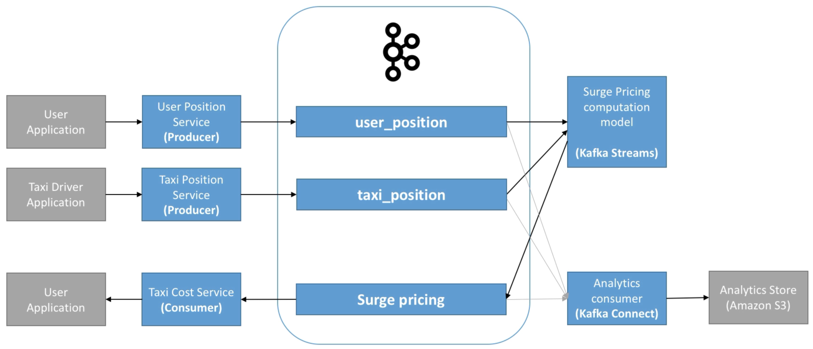

# GetTaxi - IoT Use Case

GetTaxi is a company that allows people to match with taxi drivers on demand.

The business wants the following capabilities:

- User should match with a close by driver
- Pricing should "surge" if number of drivers are low or number of users is high
- All position data before and during ride should be stored in analytics store so that the cost can be computed accurately

How to implement using Kafka?

> 

- taxi_position, user_position topics:
  - Topics that can have multiple producers
  - Should be highly distributed if high volume > 30 partitions
  - Keys such as "user-id" and "taxi-id"
  - Data is ephemeral and probably doesn't need to be kept for a long time
- surge_pricing topic
  - Computation of Surge pricing comes from the Kafka Streams application
  - Surge pricing may be regional and therefore that topic may be high volume 

- Other possible topics:
  - "weather" of "events" can be included in the Kafka Streams application