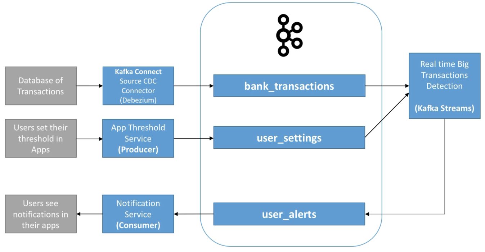

# MyBank - Use Case

MyBank is a company that allows real time banking for users.

The company wants to deploy a new capability to alert users in case of large transactions.

- The transaction data already exists in a database
- Thresholds can be defined by users
- Alerts must be sent in real time to users

How to implement this using Kafka?

- Bank transactions topic

  - Kafka Connect Source is a great way to expose data from existing databases
  - There are tons of CDC (change data capture) connectors for technologies such as PostreSQL, Oracle, MySQL, SQLServer, MongoDB etc

- Kafka Streams application

  - When a user changes their settings, alerts won't be triggered for past transactions

- User threshold topics

  - Best to send "events" to the topic e.g.

    user-123 enabled threshold at £1000 at 12pm on 12th July 2018 than just sending state such as

    user-123: threshold £1000