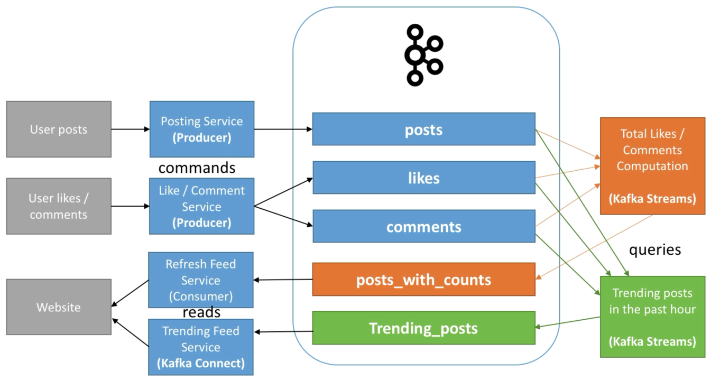

# MySocialMedia - CQRS Use Case

MySocialMedia is a company that allows people to post images and others to react by using "likes" and "comments".

The business wants the following capabilities:

- Users should be able to post, like and comment
- Users should see total number of likes and comments per post in real time
- High volume of data expected on launch day
- Users should be able to see "trending" posts

How to implement using Kafka?

> 

CQRS = Command Query Responsibility Segregation

- Responsibilities are **segregated** hence we can call the model CQRS
- Posts
  - Topic that can have multiple producers
  - Should be highly distributed if high volume > 30 partitions
  - Maybe choose key "user-id"
  - Probably want a high retention period of data for this topic
- Likes, Comments
  - Topics with multiple producers
  - Should be highly distributed as the volume of data is expected to be much greater
  - Maybe choose key "post-id"
- Data itself in Kafka should be formatted as "events":
  - user-123 created post-id 456 at 2pm
  - user-234 liked post-id 456 at 3pm
  - user-123 deleted post-id 456 at 6pm