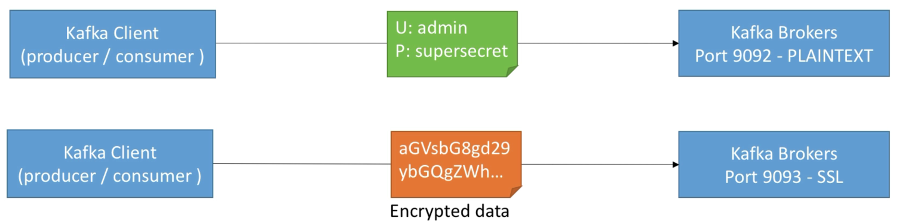
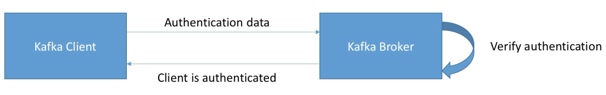

# Security

## Encryption

- Encryption in Kafka ensures that the data exchanged between clients and brokers is secret to routers on the way
- This is similar concept to an HTTPS website

## Authentication

- Authentication in Kafka ensures that only **clients that can prove their identity** can connect to our Kafka cluster
- Similar concept to a login (username / password)

Authentication in Kafka can take a few forms:

- SSL Authentication - clients authenticate to Kafka using SSL certificates
- SASL Authentication
  - PLAIN - clients authenticate using username / password (weak - easy to setup)
  - SCRAM - username / password (string - medium to setup)
  - Kerberos - such as Microsoft Active Directory (strong - hard to setup)

## Authorisation

e.g.

- User alice can view topic finance
- User bob cannot view topic trucks

These are called ACL (Access Control Lists) and have to be maintained by administration and onboard new users.