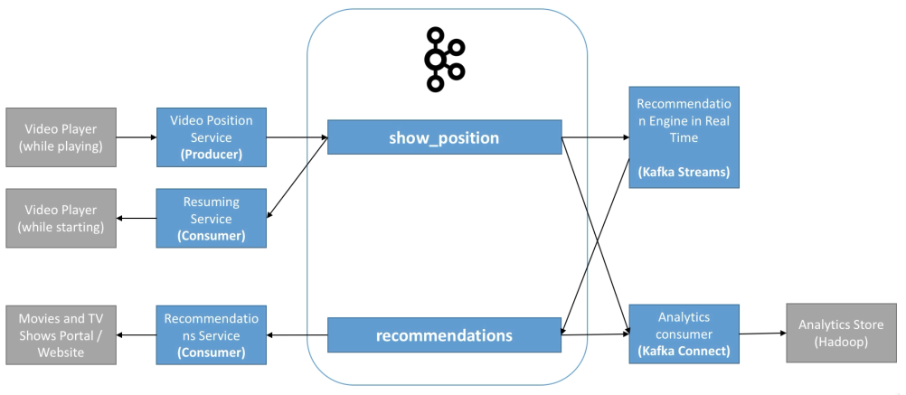

# VideoFlix - Use Case

VideoFlix is a company that allows you to watch videos on demand - the business wants the following capabilities:

- Make sure the user can resume a video where they left off

- Build a user profile in real time

- Recommend the next video to the user in real time

- Store all data in analytics store

How to implement this using Kafka?

- show_position topic:
  - Is a topic that can have multiple producers
  - Should be highly distributed if high volume > 30 partitions
  - Maybe choose key "user-id"
- recommendations topic:
  - Kafka Streams recommendation engine may source data from analytical store for training
  - May be low volume topic
  - Maybe choose key "user-id"