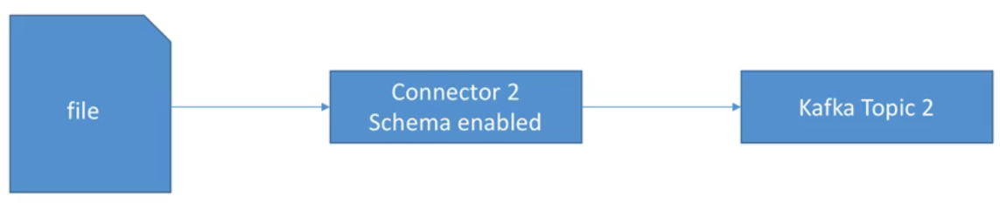
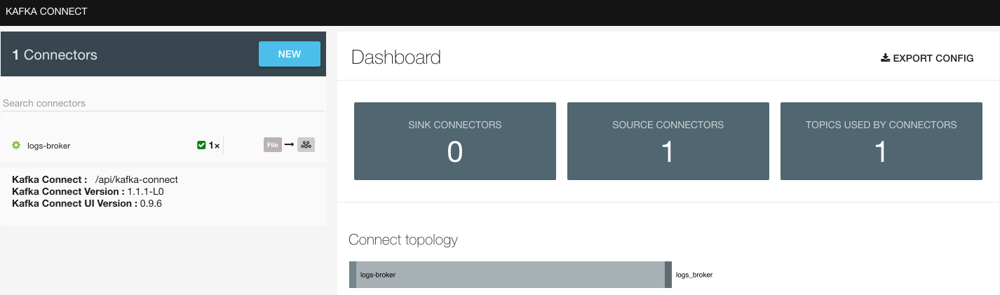
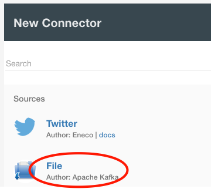
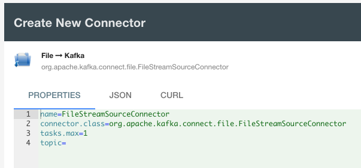
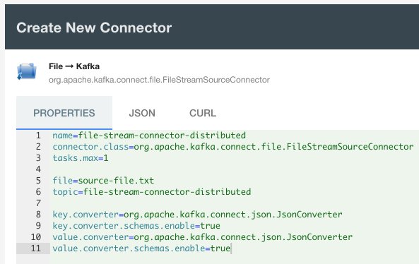
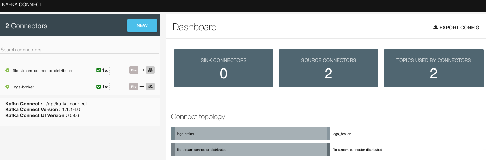
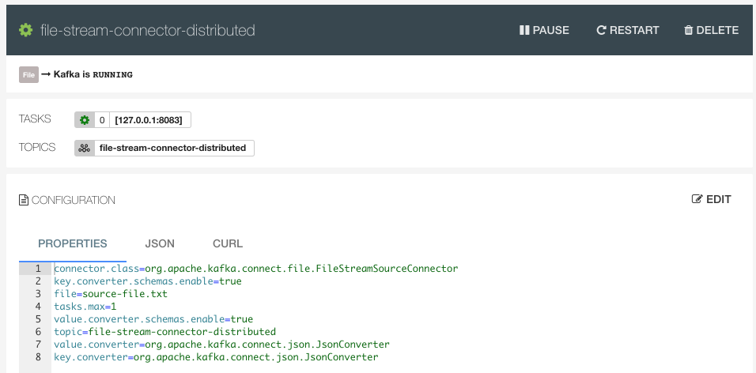
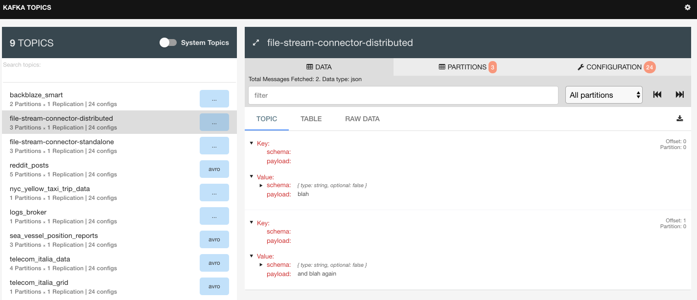

# File Stream Source Connector - Distributed

To start a Kafka cluster and associated services, there is a [docker-compose.yml](../../docker-compose.yml) within the **connect-course** directory.

The resources for this example are within this directory **file-stream-source-connector-distributed**.

- Read a file and load content directly into Kafka
- Run connector in distributed mode

> 

Boot Kafka cluster (Note that your Docker Daemon needs at least 4GB):

```bash
$ docker-compose up kafka-cluster
```

With Kafka up and running, create the topic for publication:

```bash
$ kafka-topics --zookeeper 127.0.0.1:2181 --create --topic file-stream-connector-distributed --partitions 3 --replication-factor 1
Created topic "file-stream-connector-distributed".
```

Go to the [Kafka Connect UI](http://127.0.0.1:3030/kafka-connect-ui) to setup a new connector:

> 

> 

> 

> 

We can replace the above with what we want in [file-stream-connector-distributed.properties](file-stream-connector-distributed.properties):

```properties
name=file-stream-connector-distributed
connector.class=org.apache.kafka.connect.file.FileStreamSourceConnector
tasks.max=1

file=source-file.txt
topic=file-stream-connector-distributed

key.converter=org.apache.kafka.connect.json.JsonConverter
key.converter.schemas.enable=true
value.converter=org.apache.kafka.connect.json.JsonConverter
value.converter.schemas.enable=true
```

noting that the properties configured in the UI does not like spaces before and after the **=**.

> 

And then **create**:

> 

Upon selecting this new connector:

> 

As this connector is in distributed mode, we need a "distributed" file - essentially the file that will act as the **source** needs to be in our cluster (in the container that was launched to run the cluster).

```bash
$ docker ps
CONTAINER ID   IMAGE                   COMMAND
e13c133c60c4   landoop/fast-data-dev   "/usr/bin/dumb-init …"

$ docker exec -it e13c133c60c4 bash
root@fast-data-dev / $ touch source-file.txt
root@fast-data-dev / $ echo "blah" >> source-file.txt
root@fast-data-dev / $ echo "and blah again" >> source-file.txt
```

And back in [Kafka topics](http://127.0.0.1:3030/kafka-topics-ui/#/cluster/fast-data-dev/topic/n/file-stream-connector-distributed/):

> 

We can of course consume from the topic to also check for messages e.g.:

```bash
$ kafkacat -C -b 127.0.0.1:9092 -t file-stream-connector-distributed -o beginning
{"schema":{"type":"string","optional":false},"payload":"blah"}
{"schema":{"type":"string","optional":false},"payload":"and blah again"}
```

```bash
$ kafka-console-consumer --bootstrap-server 127.0.0.1:9092 --topic file-stream-connector-distributed --from-beginning
{"schema":{"type":"string","optional":false},"payload":"blah"}
{"schema":{"type":"string","optional":false},"payload":"and blah again"}
```


