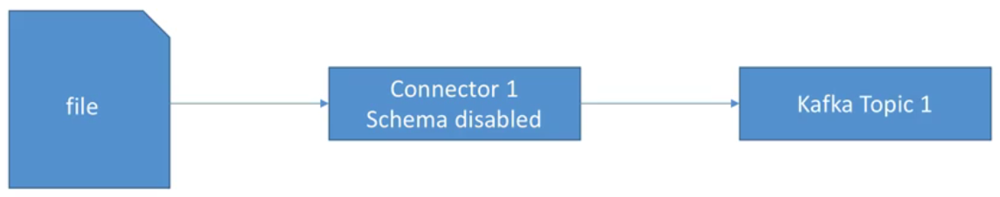

# File Stream Source Connector - Standalone

To start a Kafka cluster and associated services, there is a [docker-compose.yml](../../docker-compose.yml) within the **connect-course** directory.

The resources for this example are within this directory **file-stream-source-connector-standalone**.

- Read a file and load content directly into Kafka
- Run connector in standalone mode (useful for development)

> 

Boot Kafka cluster (Note that your Docker Daemon needs at least 4GB):

```bash
$ docker-compose up kafka-cluster
```

The following instantiates a container with all files in the current directory mounted (mapped) to **/app** within the container i.e. the resources are now available in the container as a volume - specifically the container will have access to **source-file.txt** we will be updating:

```bash
$ docker run --rm -it -v "$(pwd)":/app --net=host landoop/fast-data-dev bash

root@fast-data-dev / $ cd /app

root@fast-data-dev / $ ls -las
total 16
0 drwxr-xr-x 6 root root  192 Dec 12 15:32 .
4 drwxr-xr-x 1 root root 4096 Dec 12 15:34 ..
0 -rw-r--r-- 1 root root    0 Apr 18  2017 source-file.txt
4 -rw-r--r-- 1 root root 1271 Dec 12 10:36 docker-compose.yml
4 -rw-r--r-- 1 root root  394 Apr  8  2017 file-stream-connector-standalone.properties
4 -rw-r--r-- 1 root root  784 Apr  8  2017 worker.properties
```

With Kafka up and running, create the topic for publication:

```bash
$ kafka-topics --zookeeper 127.0.0.1:2181 --create --topic file-stream-connector-standalone --partitions 3 --replication-factor 1
Created topic "file-stream-connector-standalone".
```

If we don't run the above command, upon publication the topic **file-stream-connector-standalone** would still be created but with only 1 partition (so no parallelism). At this point, we can take a look at this topic in the [browser](http://127.0.0.1:3030/kafka-topics-ui/#/).

> 

Start the **connector** which will stream data from **source-file.txt** to our **file-stream-connector-standalone** Kafka topic.

```bash
$ connect-standalone worker.properties file-stream-connector-standalone.properties
```

Enter some text into the source file (remembering that it is mapped so the container will see the changes) and upon saving the connector application will get that data and publish onto Kafka:

> 

Note that the file **standalone.offsets** is generated.