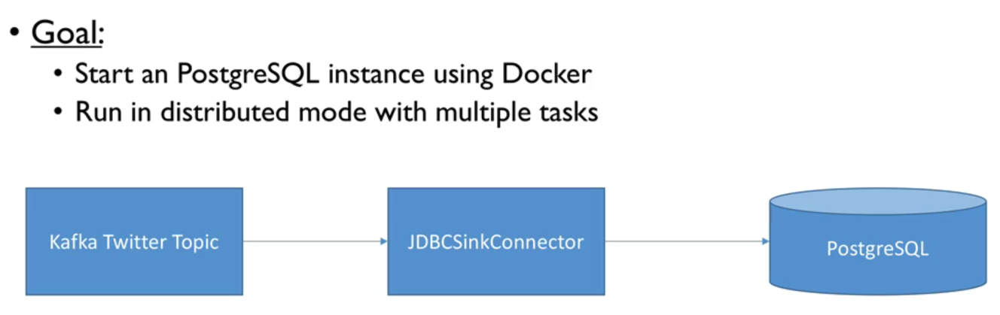
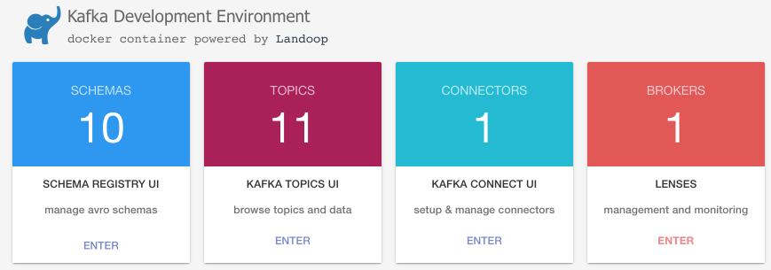
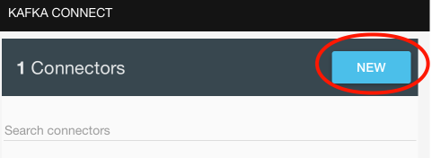
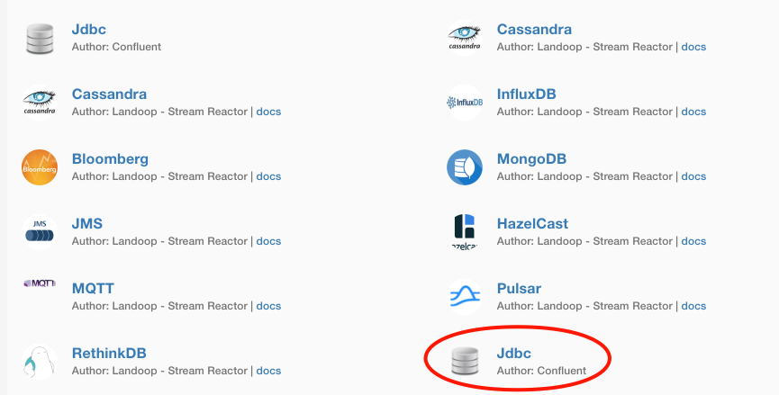
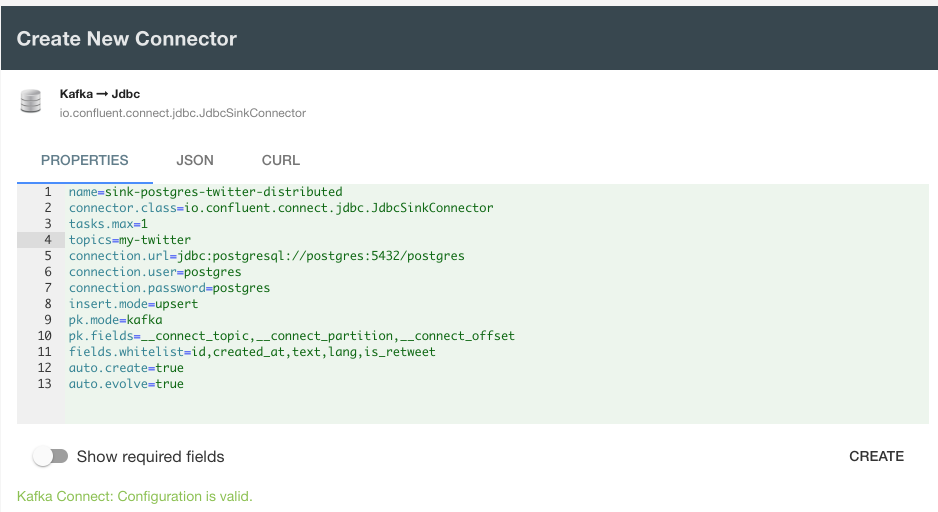
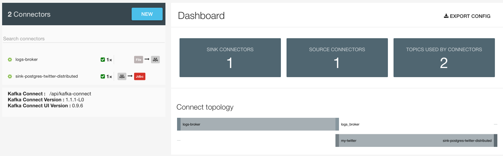
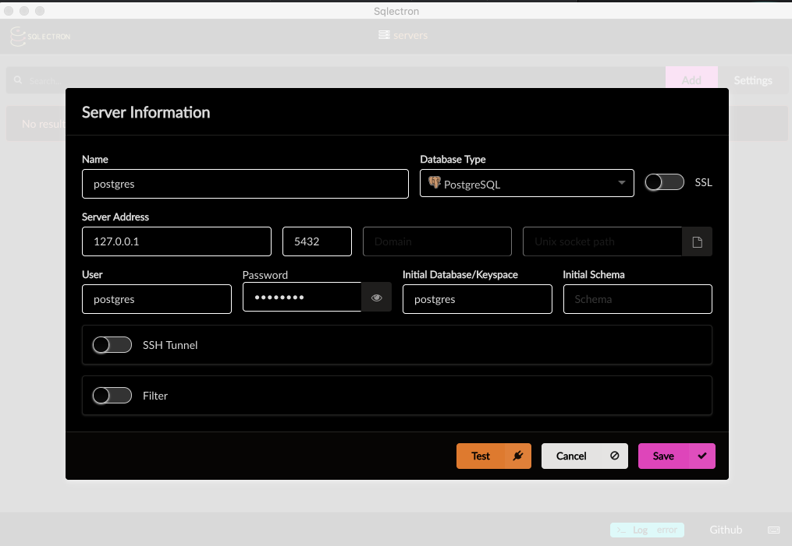

# JDBC Connector

> 

We need a Kafka cluster - In root of this project run the [docker-compose.yml](../../docker-compose.yml) which also starts an instance of **PostgesSQL**:

```bash
$ docker-compose up kafka-cluster postgres
```

Once again, we need all necessary tools:

```bash
$ docker run --rm -it --net=host landoop/fast-data-dev bash
```

Navigate to the Kafka Connect UI in the [browser](http://127.0.0.1:3030/kafka-connect-ui/#/cluster/fast-data-dev):

> 

---

> 

---

> 

---

> 

---

> 

---

> 

