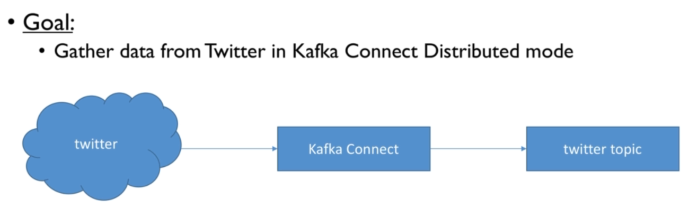
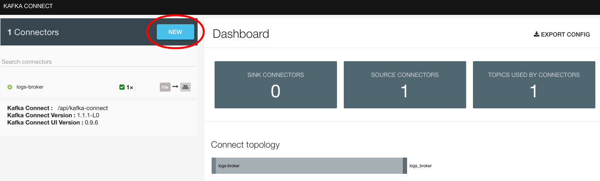
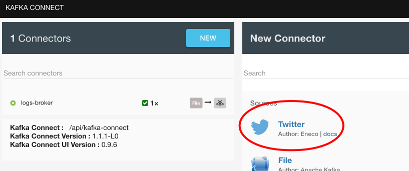
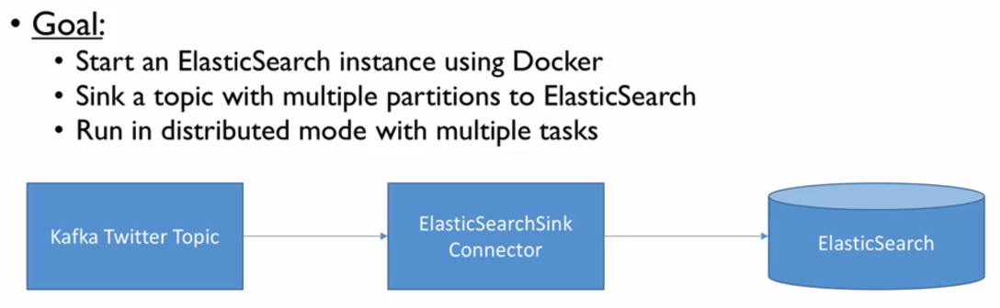
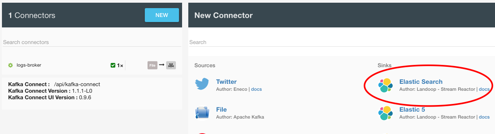
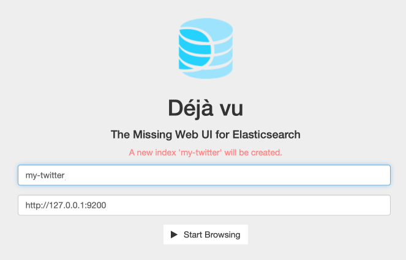

# Twitter Connector

## Source

> 

We need a Kafka cluster - In root of this project run the [docker-compose.yml](../../docker-compose.yml):

```bash
$ docker-compose up kafka-cluster
```

Now need a topic, so run:

```bash
$ docker run --rm -it --net=host landoop/fast-data-dev bash

root@fast-data-dev / $ kafka-topics --zookeeper 127.0.0.1:2181 --create --topic my-twitter --partitions 3 --replication-factor 1
Created topic "my-twitter".
```

And start a consumer on said topic (as an observer):

```bash
root@fast-data-dev / $ kafka-console-consumer --bootstrap-server 127.0.0.1:9092 --topic my-twitter
```

At this point, go to the Kafka Connect UI in the [browser](http://127.0.0.1:3030/kafka-connect-ui/#/cluster/fast-data-dev):

> 

---

> 

And provide our properties from [source-twitter-distributed.properties](source-twitter-distributed.properties).

## Sink

> 

This time start up all services in the [docker-compose.yml](../../docker-compose.yml):

```bash
$ docker-compose up kafka-cluster elasticsearch postgres
```

Let's check Elasticsearch:

```bash
$ http localhost:9200

HTTP/1.1 200 OK
Content-Length: 362
Content-Type: application/json; charset=UTF-8

{
    "cluster_name": "elasticsearch",
    "cluster_uuid": "FDlfR2BvT2m18iKpyqLINQ",
    "name": "Overmind",
    "tagline": "You Know, for Search",
    "version": {
        "build_hash": "d38a34e7b75af4e17ead16f156feffa432b22be3",
        "build_snapshot": false,
        "build_timestamp": "2016-12-07T16:28:56Z",
        "lucene_version": "5.5.2",
        "number": "2.4.3"
    }
}
```

Now create a new Elasticsearch connector with the relevant properties:

> 

Finally we can visualise Elasticsearch because of a plugin configured in our docker services.

Navigate to [http:127.0.0.1:9200/_plugin/dejavu](http:127.0.0.1:9200/_plugin/dejavu):

> 