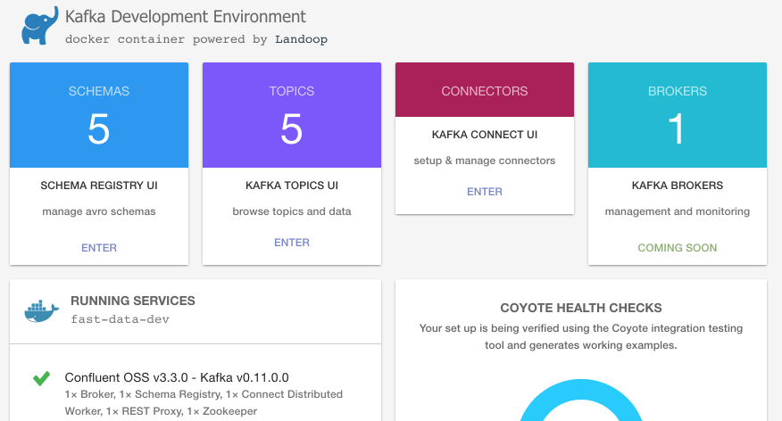

# Booting with Docker

Take a look at [docker-compose.yml](../docker-compose.yml):

## Kafka Cluster

We use Docker image [fast-data-dev](https://github.com/Landoop/fast-data-dev) which can be booted on its own (in root of this module):

```bash
$ docker-compose up kafka-cluster
```

and open a browser to view the [Kafka Development Environment UI](http://localhost:3030)

