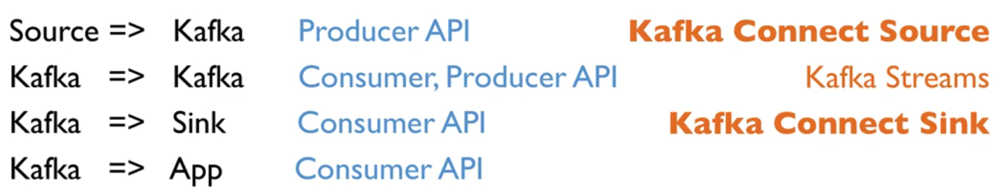
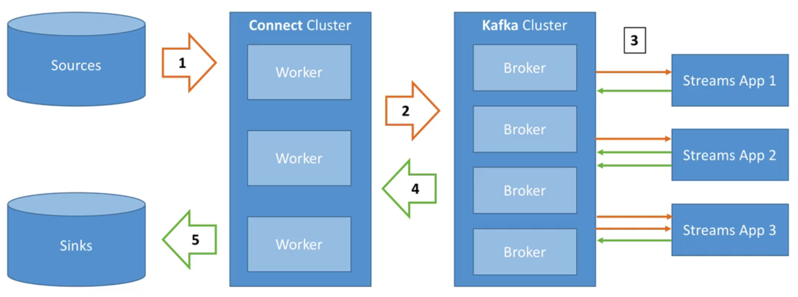
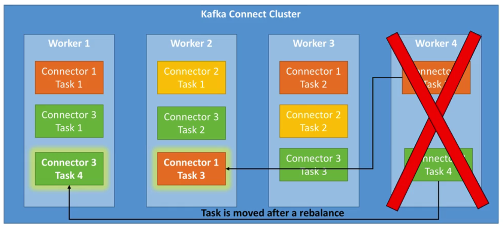

# Connect

Kafka Connect simplifies and improves getting data in and out of Kafka, as part of an ETL (extract, transform and load) pipeline.

> 

The following shows the generic use of Kafka Connect.

A Streams App could be Kafka Streams or Spark to perform data transformations, aggregations etc.

> 

Kafka Connect Cluster has multiple loaded **Connectors** - where a connector is essentially a **jar**.

**Connectors + User Configuration => Tasks**

So a task is linked to a connector configuration, and a job configuration may spawn multiple tasks.

Tasks are executed by Kafka Connect **Workers** (servers). Where a worker is a single Java process that may be standalone or in a cluster.

- Standalone
  - A single process runs your connectors and tasks
  - Configuration is bundled with your process
  - Nice for development and testing
  - Not fault tolerant; not scalable
- Distributed
  - Multiple workers run your connectors and tasks
  - Configuration submitted using REST API
  - Scalable; fault tolerant (rebalancing in case a worker dies)

Distributed example where one worker (server) crashes:

> 