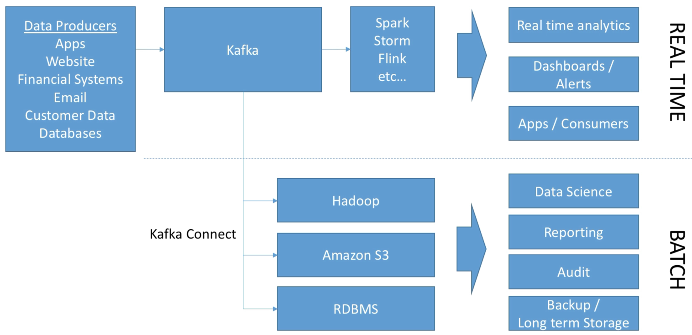

# Big Data Ingestion

- It is common to have "generic" connectors or solutions to offload data from Kafka to HDFS, Amazon S3, Elasticsearch etc.
- It is common to have Kafka serve a "speed layer" for real time applications, while having a "slow layer" which helps with data ingestions into stores for later analytics
- Kafka as a front to Big Data Ingestion is a common pattern in Big Data to provide an "ingestion buffer" in front of some stores

