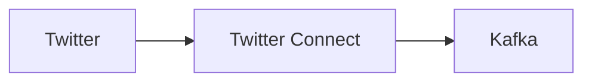

# Kafka Connect for Twitter



## Setup

Twitter Connect is configured by two **properties** files.

The first will already be on your machine if you Homebrew'd **confluent-hub-client** as per the original **setup**. It can be found at [/usr/local/etc/kafka/connect-standalone.properties](/usr/local/etc/kafka/connect-standalone.properties).

The second is to customise. We'll define as a hidden file since we need credentials there.
This file can be named anything. I've gone for **.env** where an example of this file can be found at [.env example](../twitter-kafka-connect/.env%20example).

## Execute

We need Kafka and Zookeeper running - we can run all services (excluding ours) that include Kafka and Zookeeper:

```bash
sbt dockerComposeServicesUp
```

We also need the two required topics configured in **.env** to be set up, which is handled by [docker compose services](../../docker-compose-services.yml).

Check for both topics with:

```bash
$ kafka-topics --zookeeper 127.0.0.1:2181 --list
twitter-delete-topic
twitter-status-topic
```

And finally run:

```bash
connect-standalone /usr/local/etc/kafka/connect-standalone.properties .env
```

The topics should now be filling up. Let's check with a **kafkacats** consumer:

```bash
$ kafkacat -C -b 127.0.0.1:9092 -t twitter-status-topic -o beginning
...
```

Note - I guess we could have all the above defined in its own **docker-compose**.