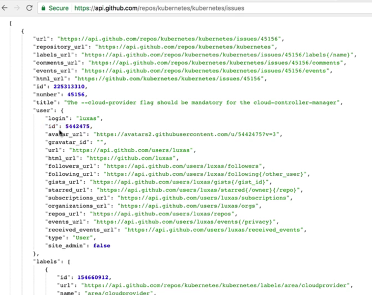
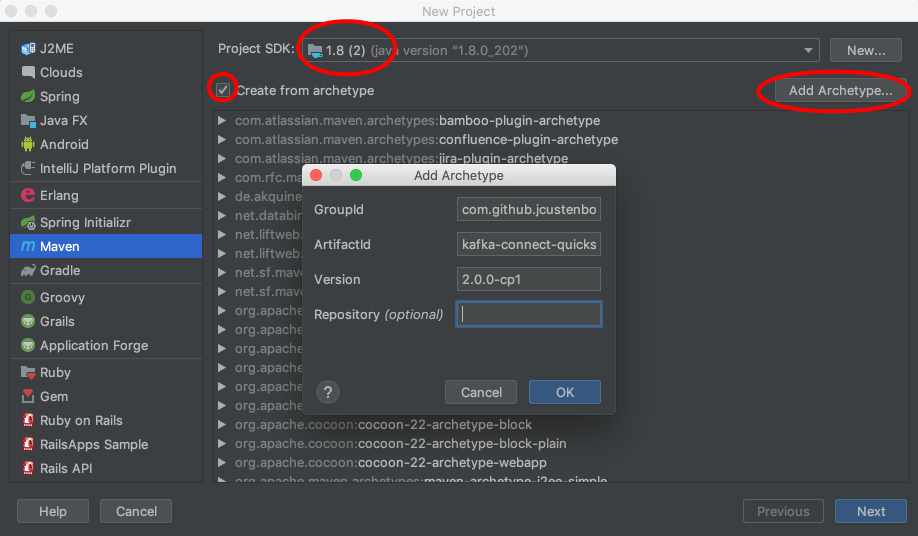
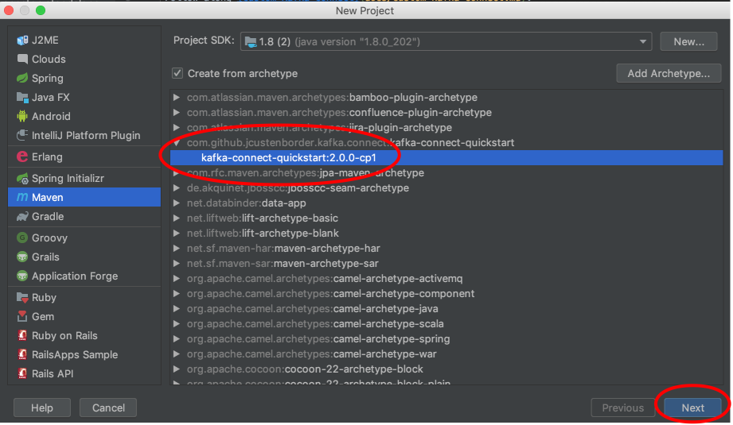
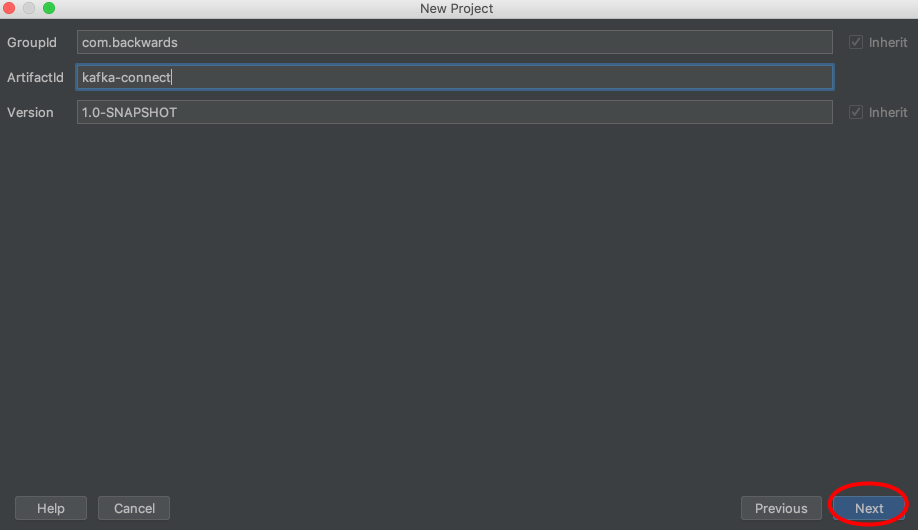
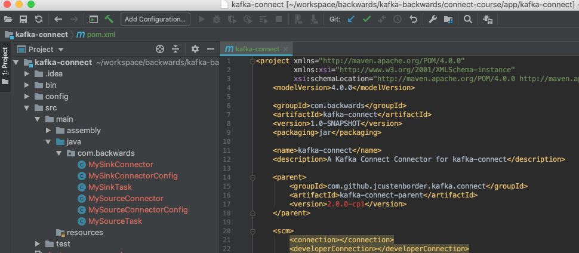

# Custom Kafka Connect

> 

Start by using [https://github.com/jcustenborder/kafka-connect-archtype](https://github.com/jcustenborder/kafka-connect-archtype):

> 

---

> 

---

> 

---

> 

and we'll end up with:

> 