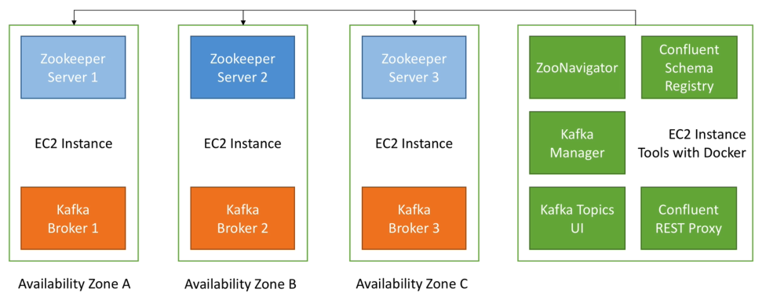
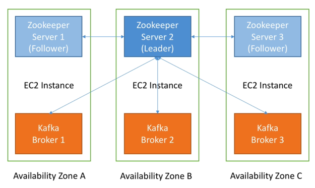

# Introduction

We aim to end up with a complete Kafka architecture in AWS:

We will run Zookeeper on the same instances as Kafka only to save a bit of money on AWS i.e. this is not recommended for production. So for teaching purposes the following will be co-located:

Note on Its and DNS (especially AWS):

- Zookeeper and Kafka must know their hostname and/or IP (in advance)
- These are not supposed to change over time, even after reboot, otherwise your setup will break

Options:

- Use an Elastic Public IP == constant public IP
  -  You will be able to access your cluster from outside e.g. laptop
- Use a secondary ENI == constant private IP (this course)
  - You will not be able to access your cluster from outside
  - You will only be able to access the cluster from within your network
- Use DNS names (private or public) == no need to keep fixed IP
  - Public means you can access instances from outside
  - Private means you can't access instances from outside

