# Setup EC2 instance

Once you've logged into your AWS account (registering if necessary):

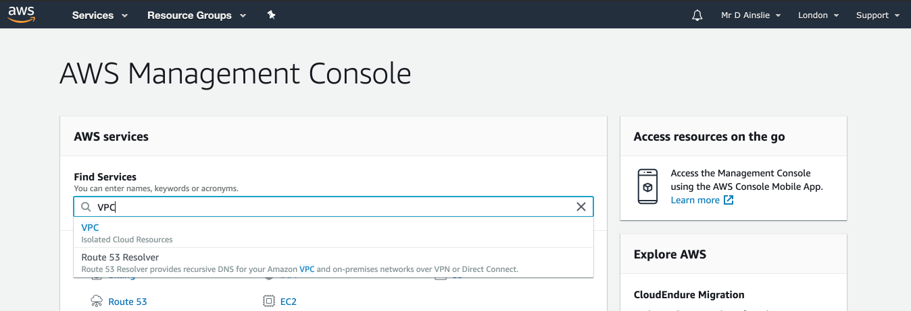

and let's first navigate to **VPC**:

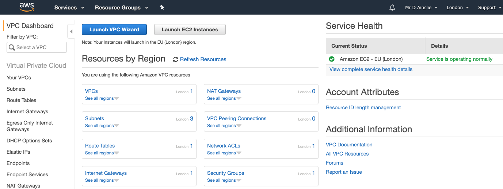

and then take a look at **subnets** which basically shows availability zones:

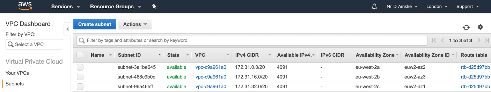

---

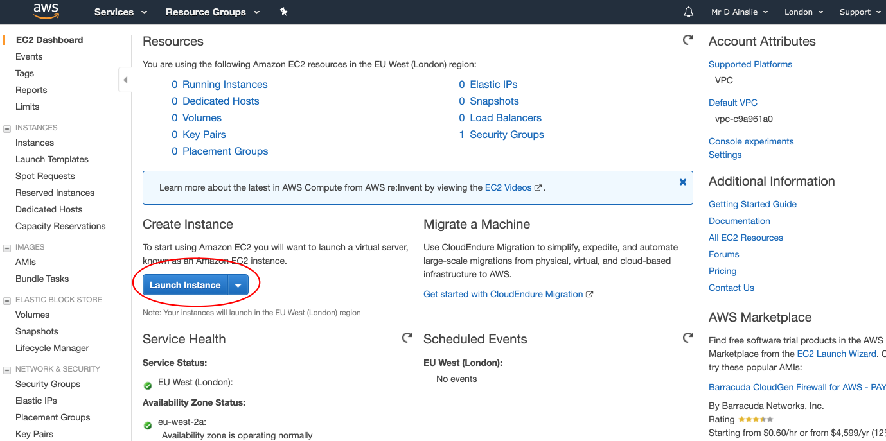

Create an EC2 instance:

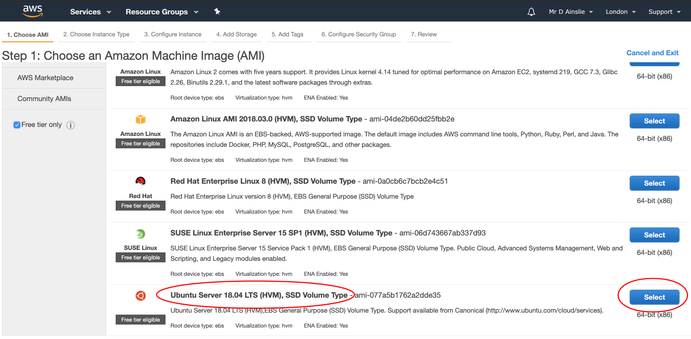

---

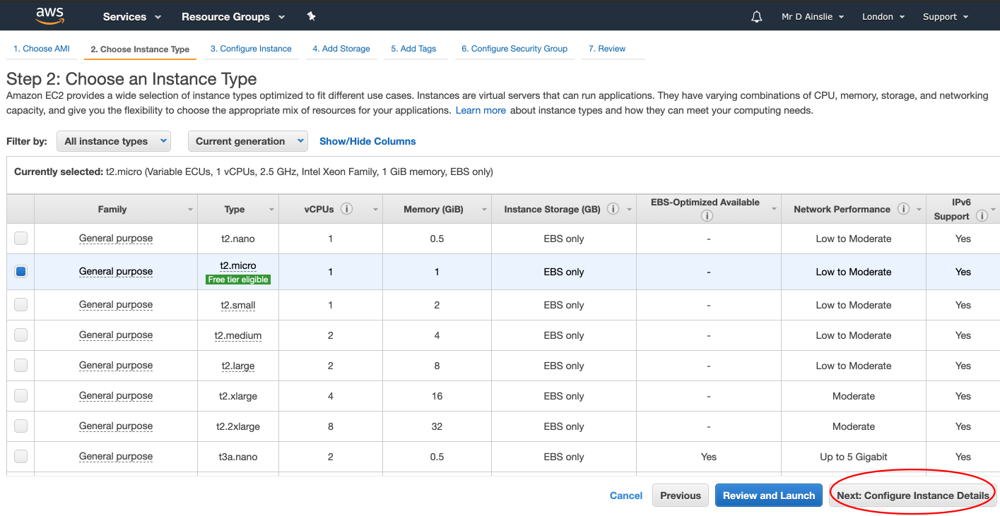

Choose subnet and add an IP in the range of that subnet e.g. I first choose **eu-west-2a** which has IP **172.31.0.0** (as noted from the screenshot above), and from this we can set a **primary IP** within **network interfaces** as say **172.31.9.1**:

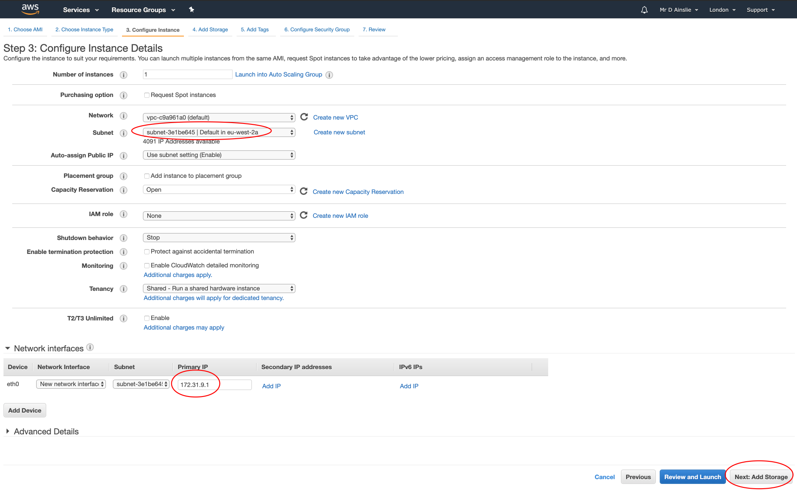

---

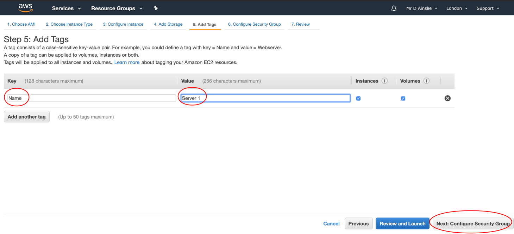

---

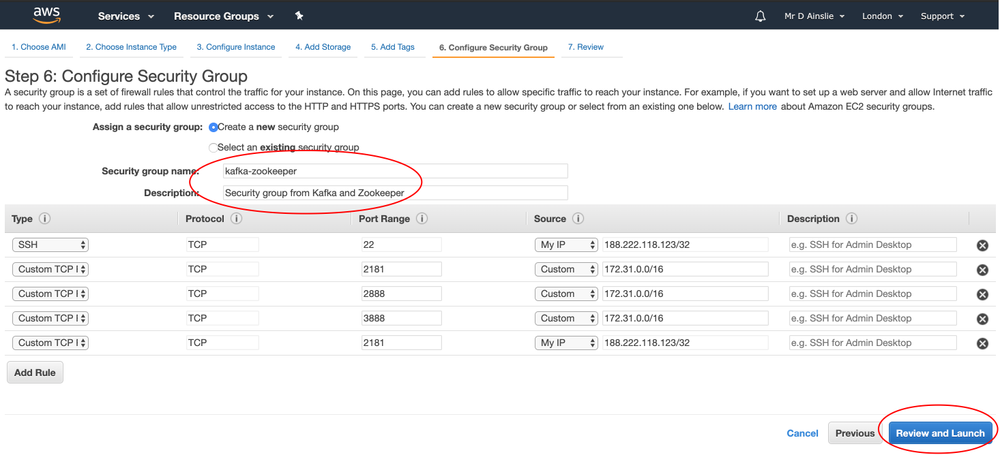

---

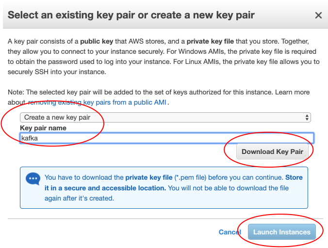

---

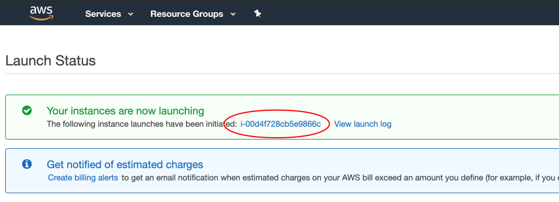

---

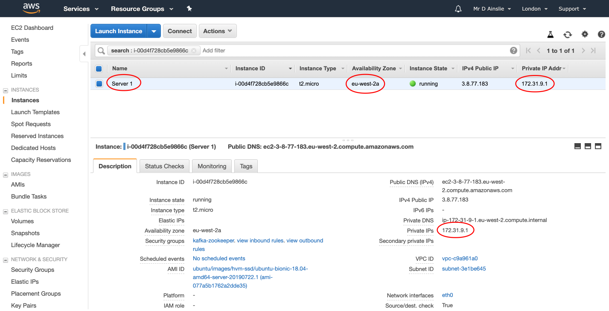

If you wish to keep the private IP, do the following:

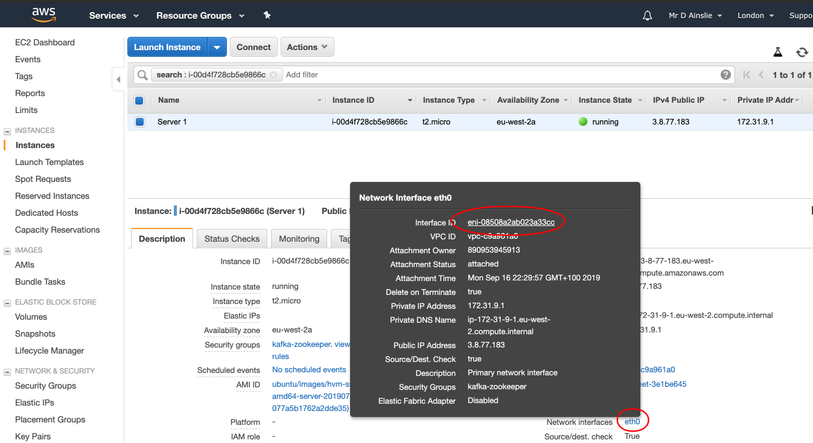

---

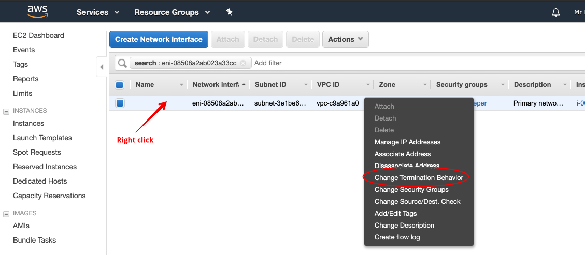

---

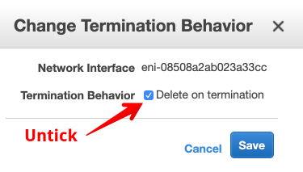