# Zookeeper Quorum Setup

Goals:

- Create an AMI (image) from the existing machine
- Create other 2 machines and launch Zookeeper on them
- Test that the Quorum is running and working

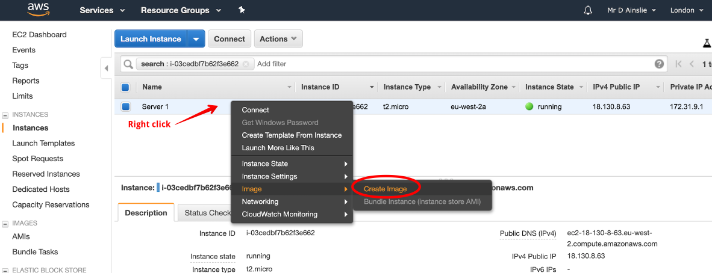

---

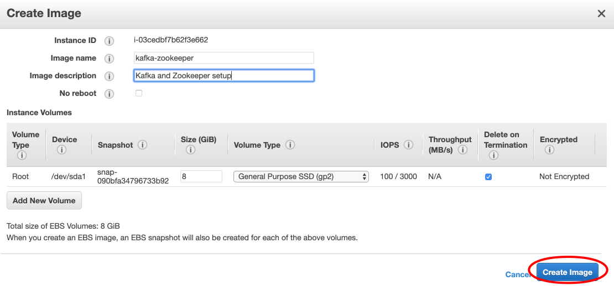

---

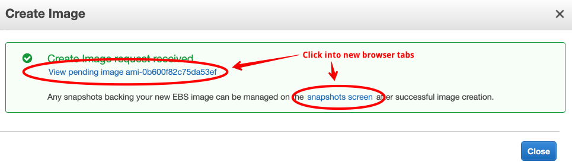

---

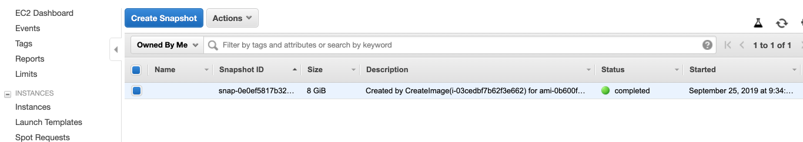

---

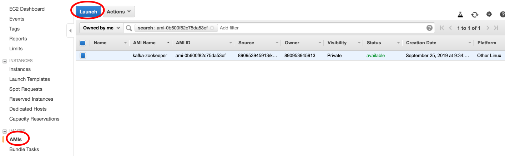

---

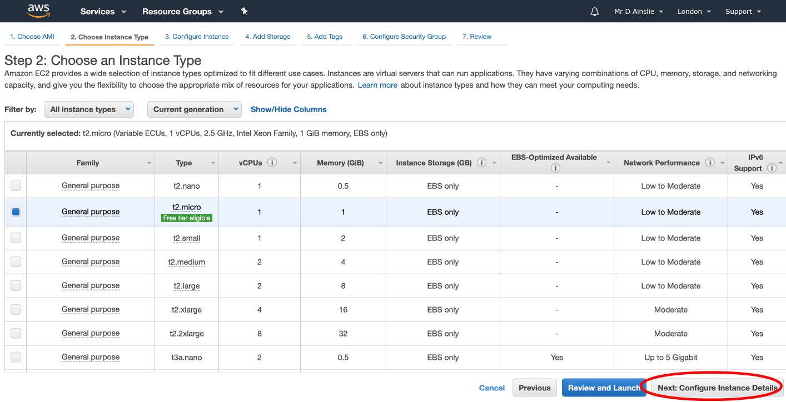

This time we choose **eu-west-2b** which has IP **172.31.16.0**, and from this we can set a **primary IP** within **network interfaces** as say **172.31.19.230**:

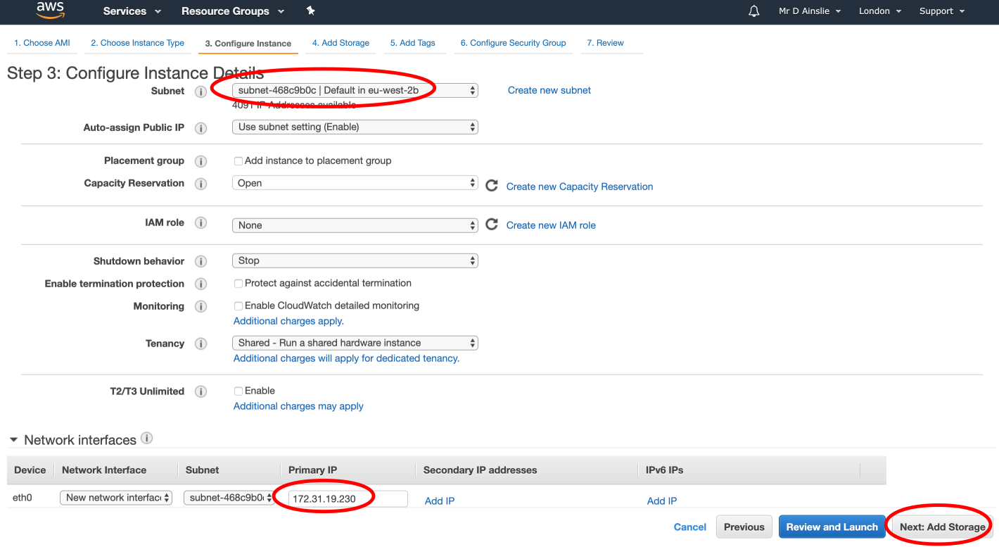

---

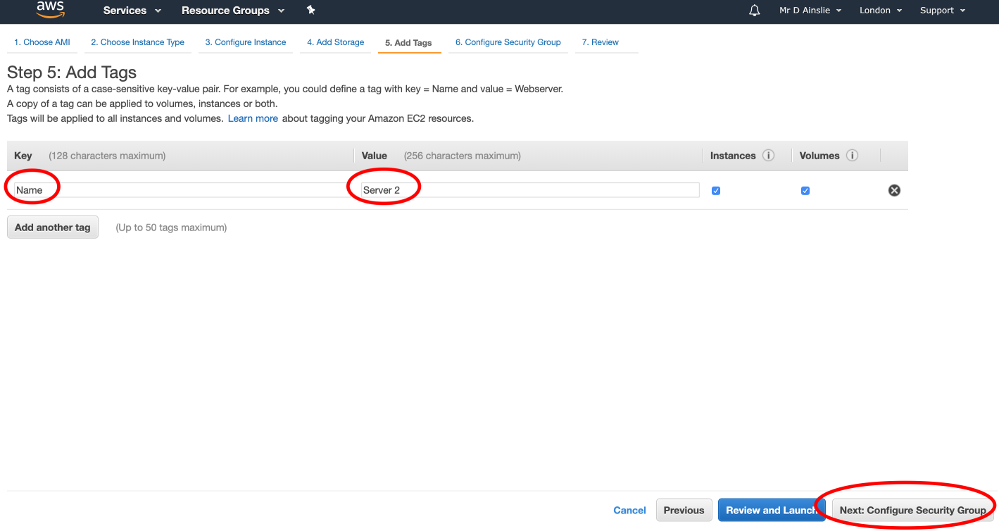

---

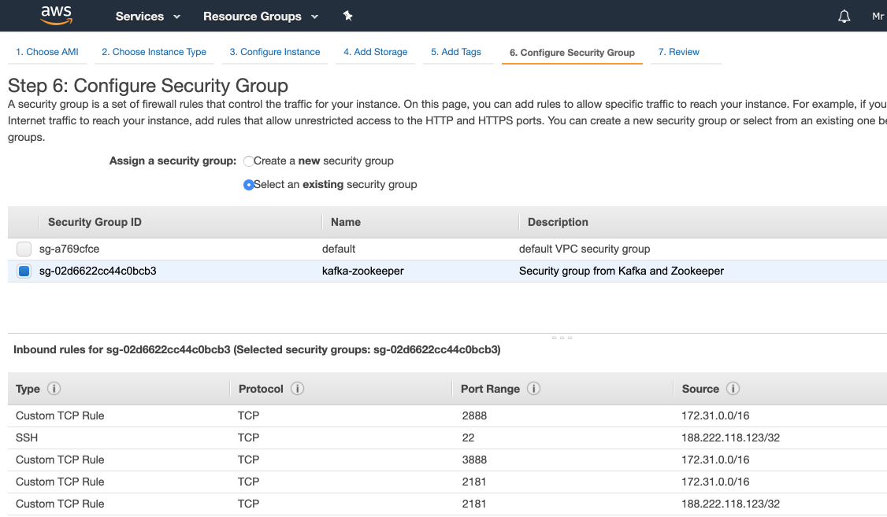

---

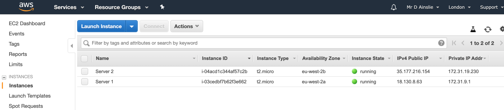

And let's launch our third instance with IP of **172.31.35.20**:

---

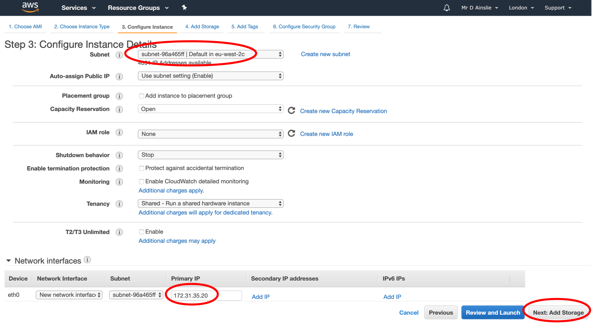

---

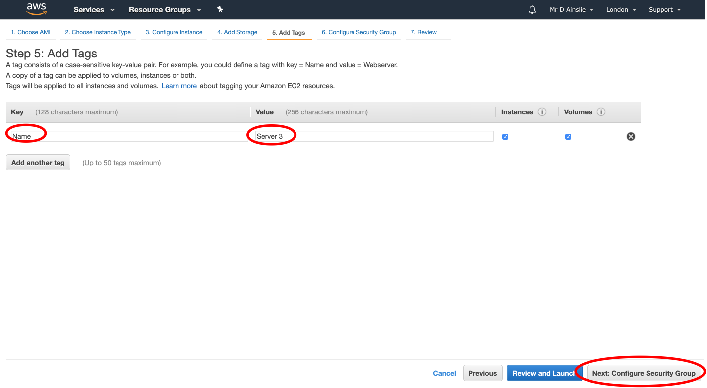

---

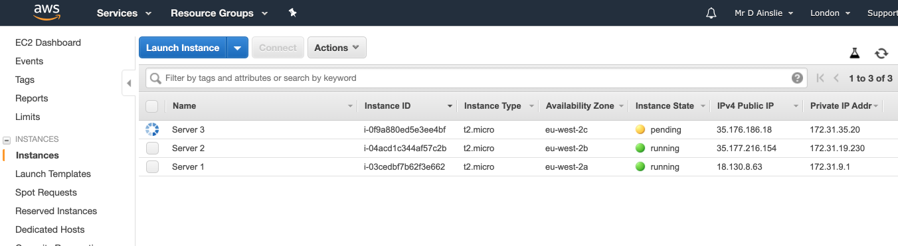

## SSH onto the three instances

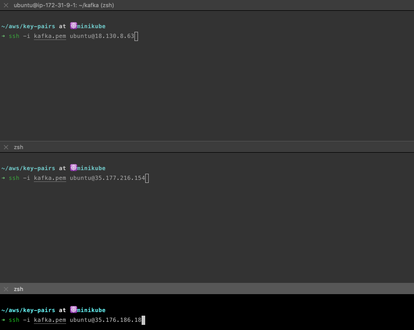

---

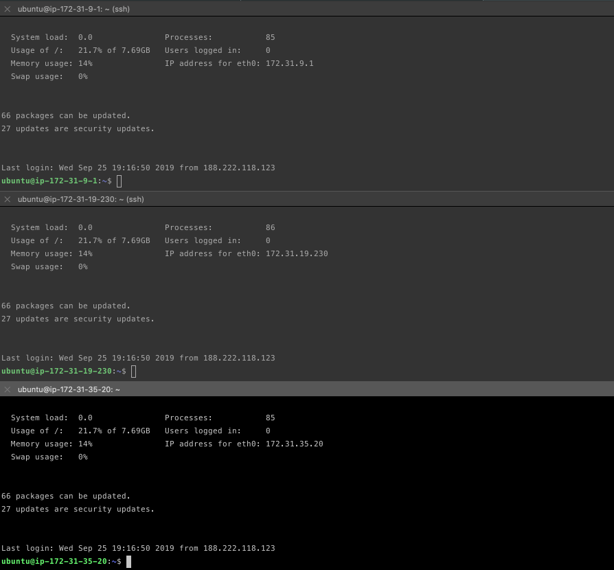