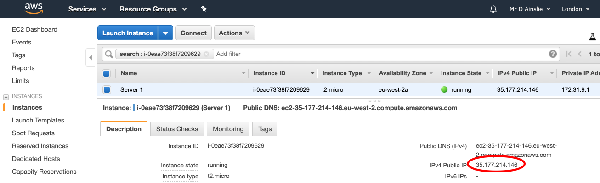

# SSH Onto Our Servers

Use the public IP of our created EC2 instance:



From your CLI, work in same directory which has your key-pair **pem** file e.g.

```bash
~/aws/key-pairs
➜ ls -las
...
8 -rw-r--r--@  1 davidainslie  staff  1696 16 Sep 22:29 kafka.pem
```

and SSH:

```bash
~/aws/key-pairs
➜ ssh -i kafka.pem ubuntu@35.177.214.146
The authenticity of host '35.177.214.146 (35.177.214.146)' can't be established.
ECDSA key fingerprint is SHA256:ZwIoHhct8EXJmO8RsB0DKr1qbCFu2cu0K9cxOfn8YXY.
Are you sure you want to continue connecting (yes/no)? yes
Warning: Permanently added '35.177.214.146' (ECDSA) to the list of known hosts.
@@@@@@@@@@@@@@@@@@@@@@@@@@@@@@@@@@@@@@@@@@@@@@@@@@@@@@@@@@@
@         WARNING: UNPROTECTED PRIVATE KEY FILE!          @
@@@@@@@@@@@@@@@@@@@@@@@@@@@@@@@@@@@@@@@@@@@@@@@@@@@@@@@@@@@
Permissions 0644 for 'kafka.pem' are too open.
It is required that your private key files are NOT accessible by others.
This private key will be ignored.
Load key "kafka.pem": bad permissions
ubuntu@35.177.214.146: Permission denied (publickey).
```

Boo. We need to reduce the permissions on the pem file:

```bash
~/aws/key-pairs
➜ chmod 0600 kafka.pem
```

Let's try again:

```bash
~/aws/key-pairs
➜ ssh -i kafka.pem ubuntu@35.177.214.146
Welcome to Ubuntu 18.04.2 LTS (GNU/Linux 4.15.0-1044-aws x86_64)

 * Documentation:  https://help.ubuntu.com
 * Management:     https://landscape.canonical.com
 * Support:        https://ubuntu.com/advantage

  System information as of Tue Sep 17 21:06:36 UTC 2019

  System load:  0.24              Processes:           85
  Usage of /:   13.5% of 7.69GB   Users logged in:     0
  Memory usage: 14%               IP address for eth0: 172.31.9.1
  Swap usage:   0%

0 packages can be updated.
0 updates are security updates.

The programs included with the Ubuntu system are free software;
the exact distribution terms for each program are described in the
individual files in /usr/share/doc/*/copyright.

Ubuntu comes with ABSOLUTELY NO WARRANTY, to the extent permitted by
applicable law.

To run a command as administrator (user "root"), use "sudo <command>".
See "man sudo_root" for details.

ubuntu@ip-172-31-9-1:~$
```


