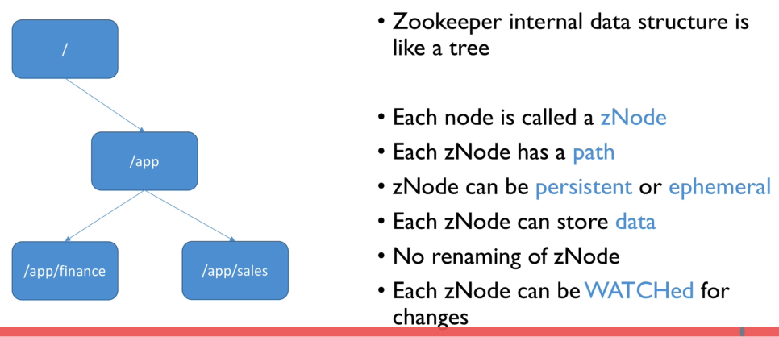

# Zookeeper

Provides:

- Distributed configuration management
- Self election / consensus building
- Coordination and locks
- Key value store

Zookeeper can be thought of as a file system:

## Role of Zookeeper With Respect to Kafka

- Brokers registration - with heartbeats mechanism to keep the list current
- Maintaining a list of topics alongside:
  - Their configuration (partitions, replication factor, additional configurations...)
  - The list of ISRs (in sync replicas) for partitions
- Performing leader elections in case some brokers go down
- Storing the Kafka cluster ID (randomly generated at first startup of cluster)
- Storing ACLs (Access Control Lists) if security is enabled:
  - Topics
  - Consumer Groups
  - Users
- Quotas configuration if enabled
- (**Deprecated**) Used by old consumer API to store consumer offsets (now in Kafka)

