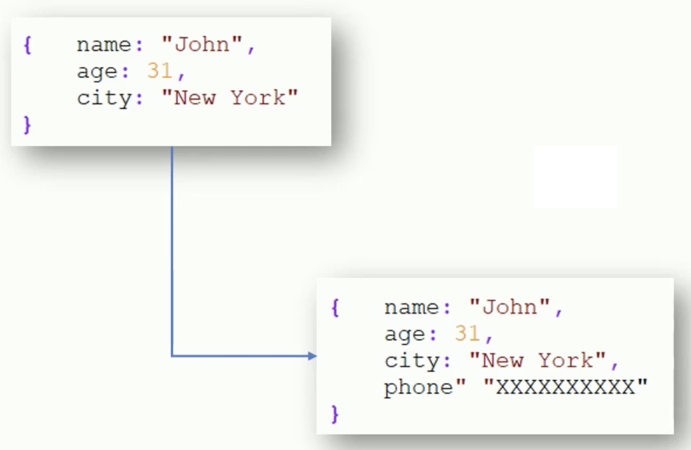
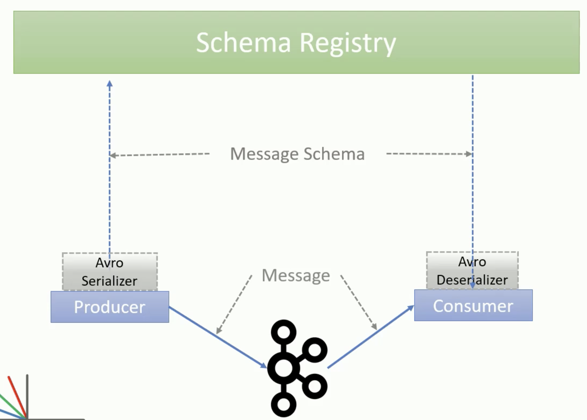

# Avro

The data that you send over Kafka evolves e.g. the following example was sending messages, but the schema has been updated to include **phone number**:

A **Schema Registry** is one solution to handling different message versions and Avro works well with this:

