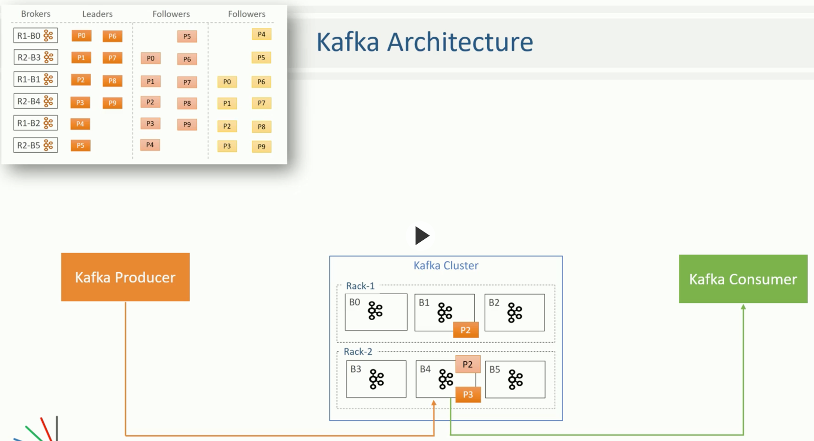
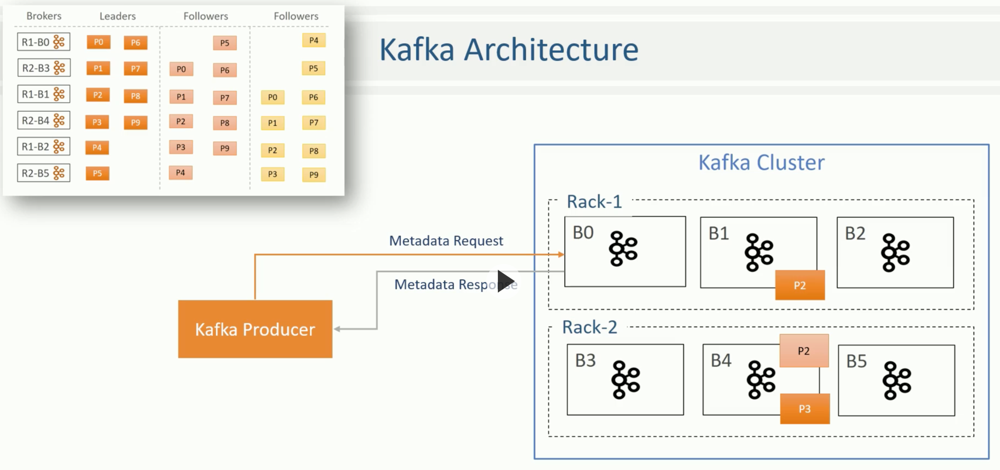
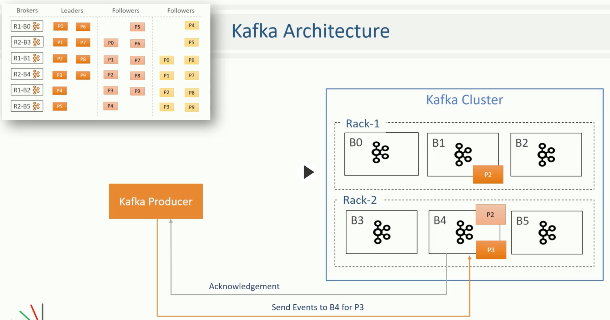
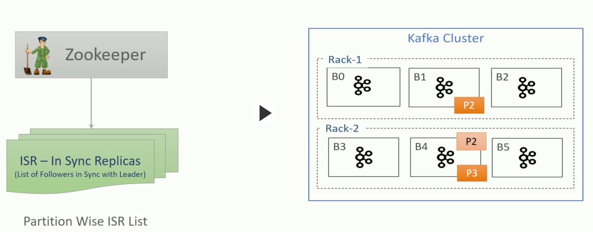
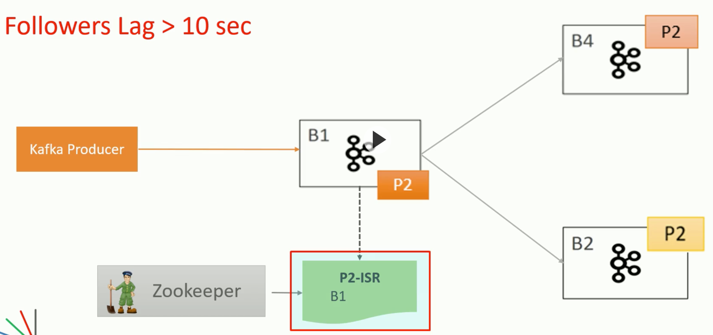
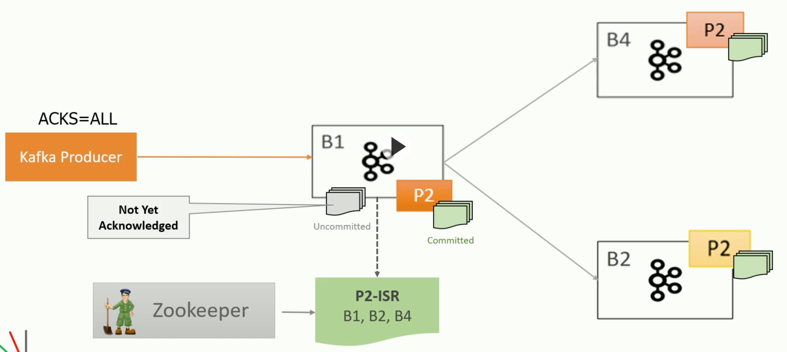
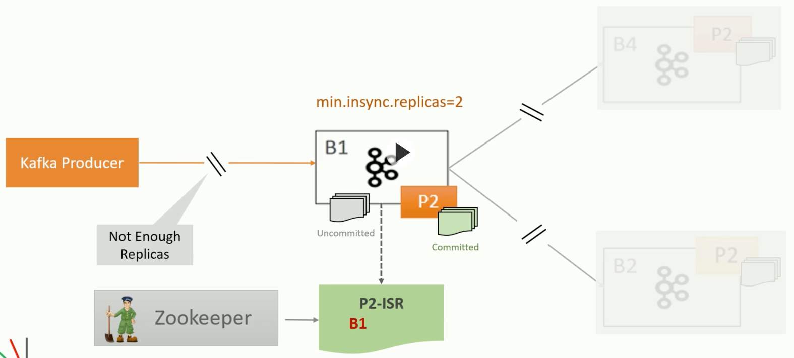

# Leaders and Followers

A Producer first makes a call to the cluster to get metadata that includes a list of the leader partitions on their respective brokers:

Producer can send event to relevant target:

A consumer also (always) reads from leader partition.

The leader broker must also keep an **in sync replica** list which is shared with Zookeeper. This list will not include the replicas that have fallen behind in their copying of events:

Example of when all followers are too far behind (default config of 10 seconds) and we effectively have an empty ISR list:

Now if the leader crashes, and we failover, we will lose some events. To avoid this, we configure **commits** where the safest is to wait until all followers have acknowledged an event. Now if the leader goes down and we failover, any **uncommitted** events will be retried by the producer and so we don't even lose those:

Finally, we can set the **min.insync.replicas** to guard against the scenario of losing all followers:

