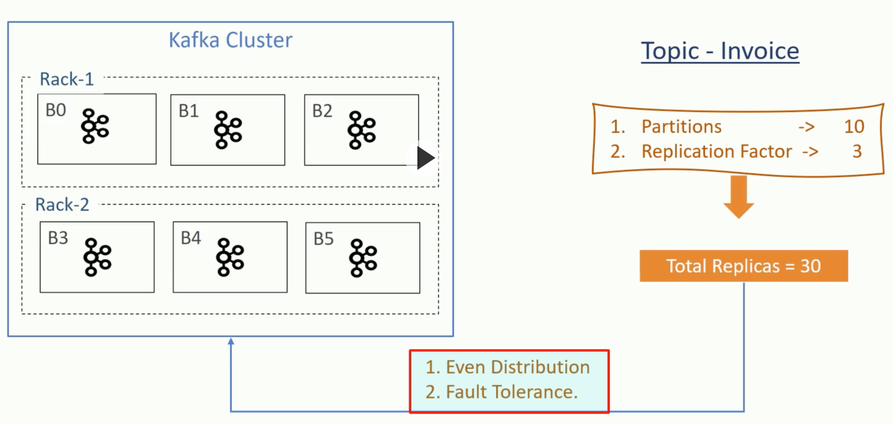
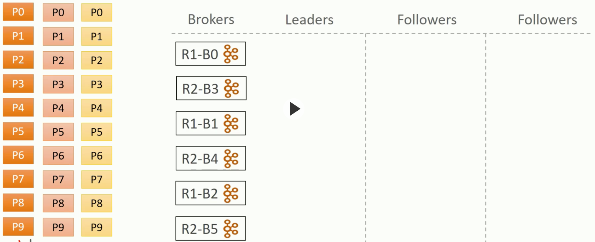
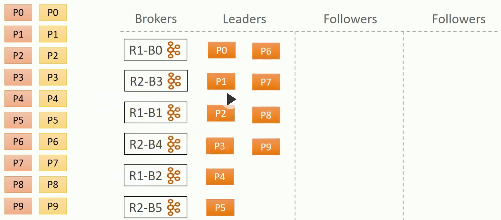
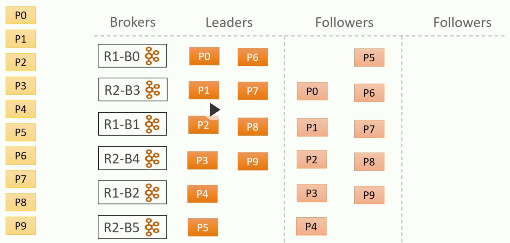
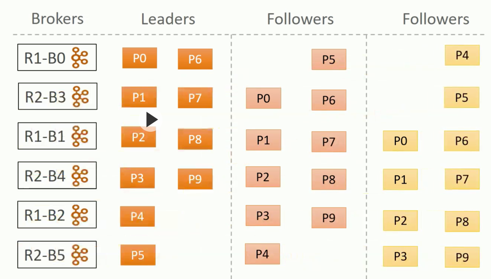

# Partitions

## Partition Assignment upon Creating a Topic

1. Ordered list of brokers
2. Leader and Followers assignment

First distribute the Leaders in round-robin, starting with the first broker in the above list:

Then distribute the Followers in round-robin, starting with the second broker in the above list:

And finally the last Followers do as above, now starting from the third broker:

