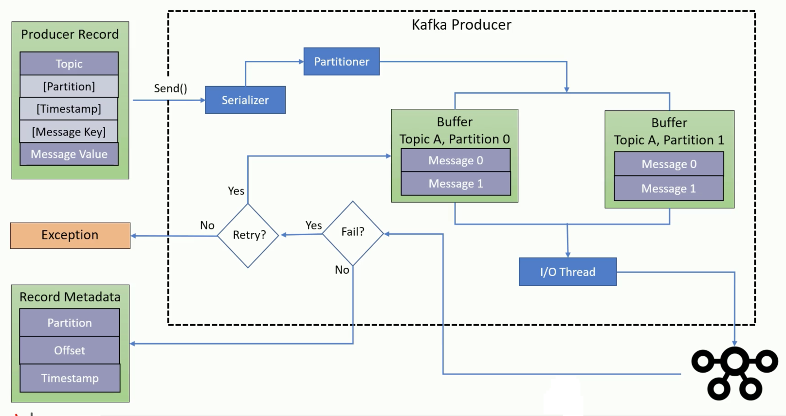
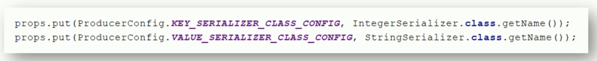
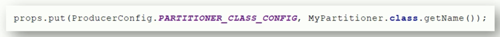
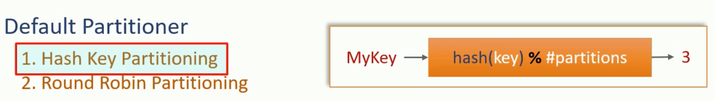
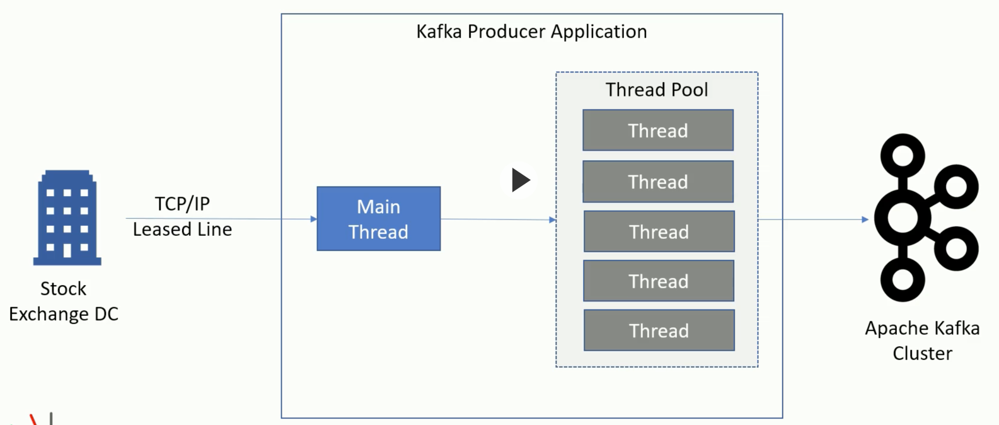
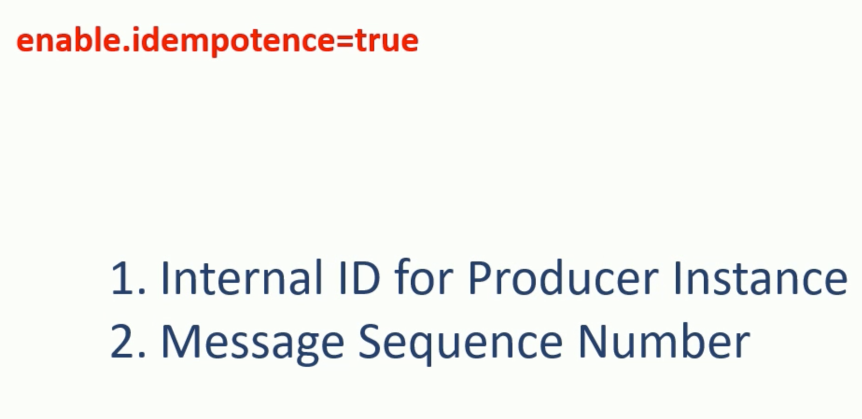

# Producers

Serializers (key and value) can be configured e.g.

Partitioner can be configured e.g.

Though usually partitioning defaults to hash or round robin (when no key is provided):

It is best to over-provision the number of partitions to avoid rebalancing.

Up to this point, we have concentrated on one producer instance. We can of course scale up to running multiple instances, but we can also have multiple threads of one instance all publishing e.g.:

In this case it is recommended to still have one producer instance but work with multiple threads (a thread pool) - a producer is thread safe.

## Exactly Once

- At least once: There is the possibility of duplicate records when a producer does not process a message acknowledgement

- At most once: By setting **retries = 0**, we avoid duplicates but then could lose messages

- Exactly once: By setting **enable.idempotence = true**, though "exactly once" only happens at **retries level** and duplicates can still occur if e.g. your application has two threads sending the same message, or functionality that sends the same message (these scenarios would be considered in a bug in the application)

