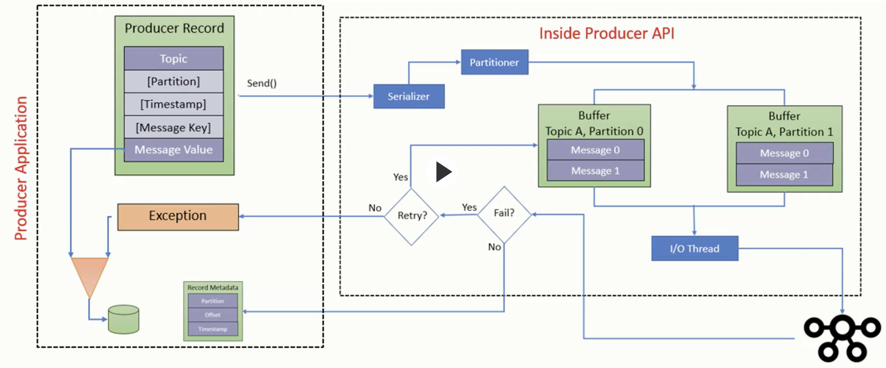

# Sync and Async

Handling message delivery failure:

Upon calling **send** on the underlying Java Kafka Producer API we can call **get** to block i.e. synchronous and will then wait for a Kafka acknowledgement or throw an exception when there is a failure.
Not that nice though - we'd probably fallback to using a Scala **Try**. Also, this approach slows down the performance of a producer.

A better approach, keeping the default asynchronous approach of the underlying API, is to supply a **callback**.