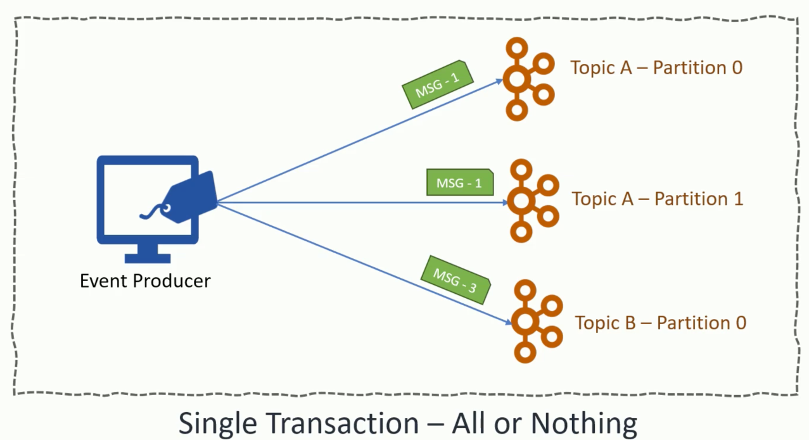
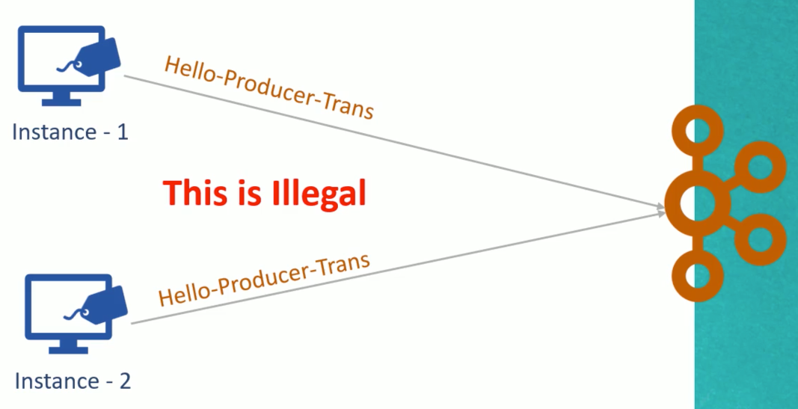
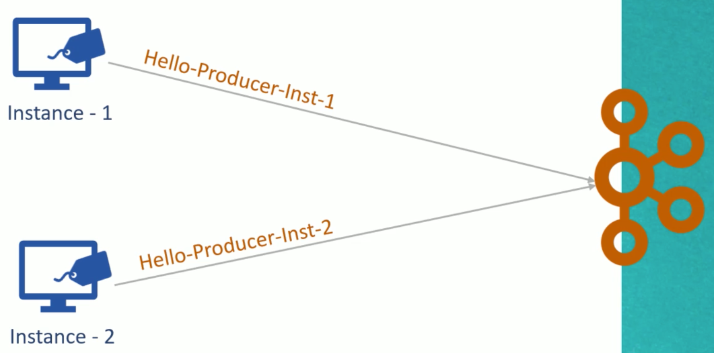

# Transactions



To use **transactions* we must have:
```properties
Replication Factor >= 3

min.insync.replicas >= 2
```

The transaction example ... relies on the following topic configurations from [docker-compose.yml](../kafka/docker/docker-compose.yml):

```yaml
kafkkafka-topics --create --zookeeper zookeeper0:2181 --topic hello-producer-1 --partitions 3 --replication-factor 3 --config min.insync.replicas=2
    kafka-topics --create --zookeeper zookeeper0:2181 --topic hello-producer-2 --partitions 3 --replication-factor 3 --config min.insync.replicas=2
```

NOTE:
- transaction depends on idempotence
- "transactional id config" must be unique for each producer instance

The second point is highlighted here:



This is solved by:

