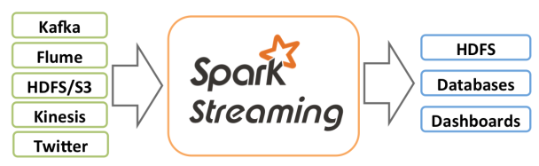
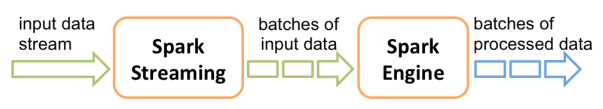
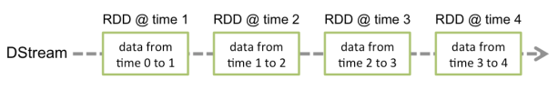

# Kafka and Spark Streaming

We'll need some Spark stuff:

```bash
$ brew install hadoop
$ brew install apache-spark
```

```bash
$ ls -las /usr/local/Cellar/hadoop
total 0
0 drwxr-xr-x    3 davidainslie  admin    96 30 May 22:39 .
0 drwxr-xr-x  243 davidainslie  admin  7776 30 May 22:40 ..
0 drwxr-xr-x   10 davidainslie  admin   320 30 May 22:40 3.1.2
```

Add to your profile e.g. .zshrc:

```properties
export HADOOP_HOME=/usr/local/Cellar/hadoop/3.1.2
export HADOOP_CONF_DIR=$HADOOP_HOME/libexec/etc/hadoop
```

and **source** it.

Check it:

```bash
$ spark-shell --conf spark.ui.port=12901
2019-06-08 20:30:40,706 WARN util.NativeCodeLoader: Unable to load native-hadoop library for your platform... using builtin-java classes where applicable
Setting default log level to "WARN".
To adjust logging level use sc.setLogLevel(newLevel). For SparkR, use setLogLevel(newLevel).
Spark context Web UI available at http://davids-mbp-4:12901
Spark context available as 'sc' (master = local[*], app id = local-1560022246354).
Spark session available as 'spark'.
Welcome to
      ____              __
     / __/__  ___ _____/ /__
    _\ \/ _ \/ _ `/ __/  '_/
   /___/ .__/\_,_/_/ /_/\_\   version 2.4.3
      /_/

Using Scala version 2.11.12 (Java HotSpot(TM) 64-Bit Server VM, Java 1.8.0_202)
Type in expressions to have them evaluated.
Type :help for more information.

scala> sc
res0: org.apache.spark.SparkContext = org.apache.spark.SparkContext@3abb6aa

scala> spark
res4: org.apache.spark.sql.SparkSession = org.apache.spark.sql.SparkSession@6b44121e

scala> sc.stop

scala> import org.apache.spark.SparkConf
import org.apache.spark.SparkConf

scala> import org.apache.spark.streaming.StreamingContext
import org.apache.spark.streaming.StreamingContext
```

## Spark Streaming

Spark Streaming is an extension of the core Spark API that enables scalable, high-throughput, fault-tolerant stream processing of live data streams. Data can be ingested from many sources like Kafka, Flume, Kinesis, or TCP sockets, and can be processed using complex algorithms expressed with high-level functions like `map`, `reduce`, `join` and `window`. Finally, processed data can be pushed out to filesystems, databases, and live dashboards.



Internally, it works as follows. Spark Streaming receives live input data streams and divides the data into batches, which are then processed by the Spark engine to generate the final stream of results in batches.



## DStreams

**Discretized Stream** or **DStream** is the basic abstraction provided by Spark Streaming. It represents a continuous stream of data, either the input data stream received from source, or the processed data stream generated by transforming the input stream. Internally, a DStream is represented by a continuous series of RDDs, which is Spark’s abstraction of an immutable, distributed dataset. Each RDD in a DStream contains data from a certain interval:



## Demo

We have a [Demo](../src/main/scala/com/backwards/streaming/spark.Demo.scala).

At the time of writing, Spark 2.4.3 supported Scala 2.11 and Spark 2.4.2 supported Scala 2.12. Interesting, and at the time of writing, this module used Scala 2.12. So you guessed it, we shall use Spark 2.4.2. Follow these steps:

Download and install [Spark 2.4.2](https://archive.apache.org/dist/spark/spark-2.4.2/)

Add to your profile (depending on your installation path) such as **.zshrc**:

```bash
export SPARK_HOME=/Applications/spark-2.4.2-bin-hadoop2.7
export PATH=${SPARK_HOME}/bin:${PATH}
```

and source it:

```bash
$ source ~/.zshrc
```

Boot Spark:

```bash
$ spark-shell
...
Spark context Web UI available at http://davids-mbp-4:4040
Spark context available as 'sc' (master = local[*], app id = local-1560534356014).
Spark session available as 'spark'.
Welcome to
      ____              __
     / __/__  ___ _____/ /__
    _\ \/ _ \/ _ `/ __/  '_/
   /___/ .__/\_,_/_/ /_/\_\   version 2.4.2
      /_/
Using Scala version 2.12.8 (OpenJDK 64-Bit Server VM, Java 12.0.1)
...
scala>
```

We shall use **spark-submit** to submit the **Demo** as a job. To do this, we need to package the Demo as a **JAR**. To make sure all necessary dependencies are included in said jar, we use [sbt-assembly](https://github.com/sbt/sbt-assembly) at the [root](../..) module:

```bash
$ sbt assembly
```

and submit:

```bash
$ spark-submit \
  --class com.backwards.streaming.spark.Demo \
  /Users/davidainslie/workspace/backwards/kafka-backwards/streaming-kafka-course/target/scala-2.12/streaming-kafka-course.jar
```


