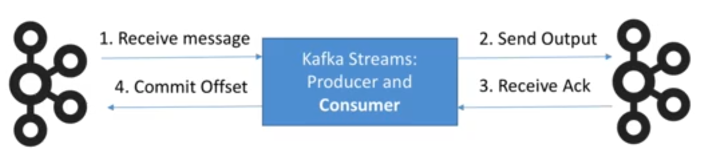
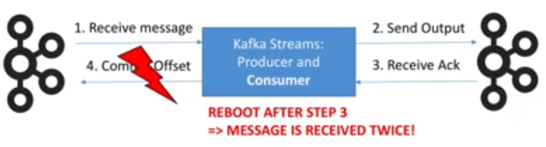
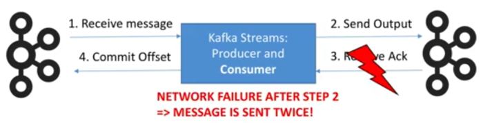

# Exactly Once

This is the ability to guarantee that data processing on each message will happen only once, and that pushing the message back to Kafka will also happen effectively only once (by a Kafka de-dup).

Guaranteed when both input and output system are Kafka.

## What can go wrong? What does Exactly Once solve?



---



---



## Exactly Once at a very high level

This functionality was introduced into Kafka 0.11.

The producers are (now) idempotent - if the same message is sent twice or more dues to retries, Kafka will make sure to only keep one copy of it.

You can write multiple messages to different Kafka topics as part of one transaction - either all are written or none are written (advanced API).

## What are some of the problems of At Least Once?

Unacceptable:

- Getting the exact count by key for a stream
- Summing up bank transactions to compute a person's bank balance
- Any financial computation
- Any operation that is not idempotent

Acceptable:

- Operations on time windows (because the time itself can be vague)
- Approximate operations (counting the number of times an IP hits a webpage to detect attacks)
- Idempotent operations (such as max, min etc.)

## How to do Exactly Once in Kafka Streams?

Just one extra configuration - add to your "props":

```scala
StreamsConfig.PROCESSING_GUARANTEE_CONFIG -> StreamsConfig.EXACTLY_ONCE
```

So why not always include this configuration? The trade off is that results are published in transactions which may incur latency, so if you can tolerate at least once because of performance requirements, then don't use this property.