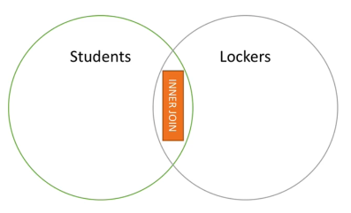
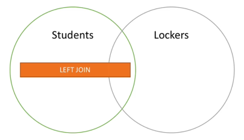
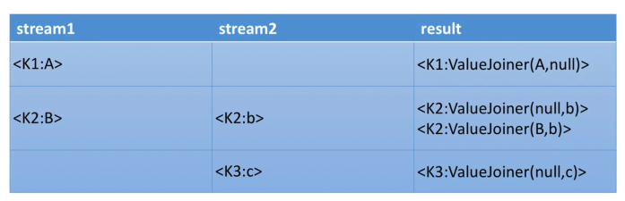

# Joins

Joining means taking a Stream and/or KTable and create a new KStream or KTable.

There are 4 kinds of joins (SQL like).

| Join operands           | Type         | (Inner) Join  | Left Join     | Outer Join    |
| ----------------------- | ------------ | ------------- | ------------- | ------------- |
| KStream to KStream      | Windowed     | Supported     | Supported     | Supported     |
| KTable to KTable        | Non windowed | Supported     | Supported     | Supported     |
| KStream to KTable       | Non windowed | Supported     | Supported     | Not Supported |
| KStream to GlobalKTable | Non windowed | Supported     | Supported     | Not Supported |
| KTable to GlobalKTable  | N/A          | Not Supported | Not Supported | Not Supported |

**Note** that data can only be joined if data is **co-partitioned**.

- Three joins:
  - KStream / KStream
  - KTable / KTable
  - KStream / KTable

**Co-partitioned**: means the **same number of partitions** on the streams and/or tables.

To co-partition data, if the number of partitions are different, **write back the topics through** Kafka before the join is applied - this has a network cost. This cost can be avoided by using **GlobalKTable**:

- If your KTable data is reasonably small and can fit on each of your Kafka Streams application, you can read it as a GlobalKTable
- With GlobalKTable you can join any stream to your table even if the data doesn't have the same number of partitions
- That's because the table data lives on every Streams application instance
- The downside is size on disk, but that's okay for reasonably sized dataset (e.g. 10,000 users)

## Inner Join

Joint the data only if it has matches in both streams of data e.g. "show me the students with a locker".

## Left Join

Join all data from left whether or not it has a match on the right e.g. "show me the students with and without a locker".

## Outer Join

- Only available for KStream / KStream joins
- It's a left join combined with a right join

