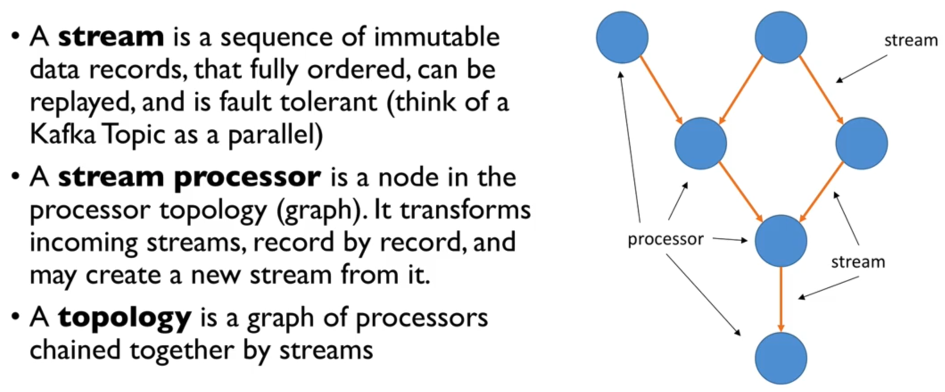
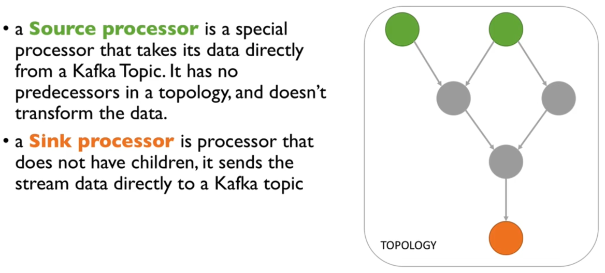

# Kafka Streams

---

## Writing the Topology

Two ways - High level DSL (recommended) or low level imperative API.

- High level DSL
  - Simple
  - Has all the operations we need to perform most transformation tasks
  - Contains a lot of syntax helpers to make our life easy
  - Descriptive

- Low level processor API
  - Imperative
  - Can be used to implement the most complex logic