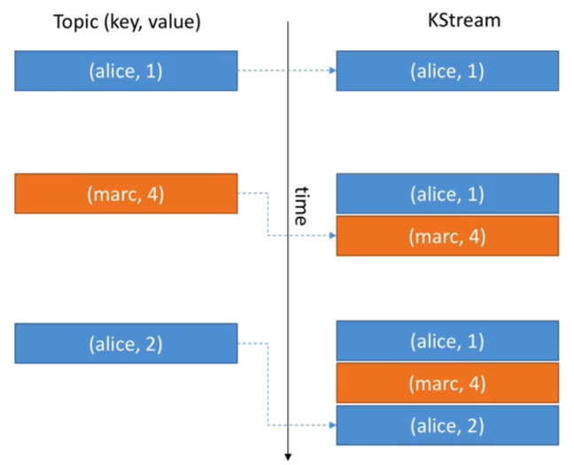
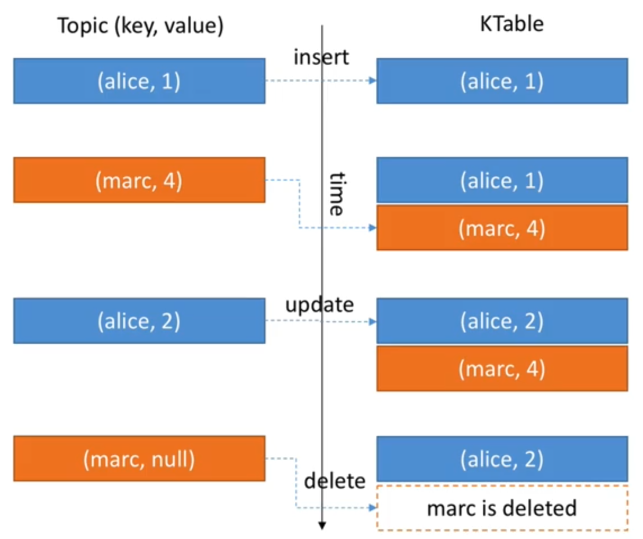
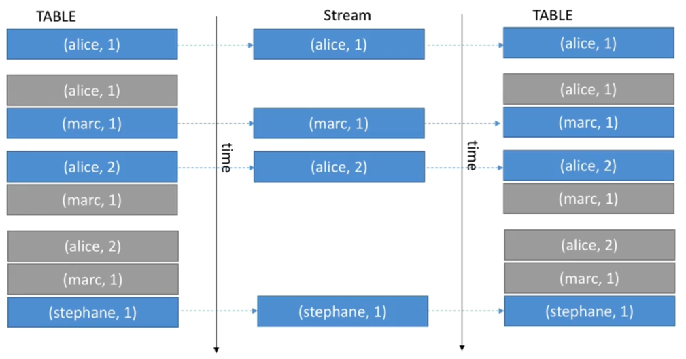

# KStream and KTable

## KStream

- All inserts
- Similar to a log
- Infinite
- Unbounded data streams

## KTable

- All upserts on non null values
- Deletes on null values
- Similar to a table
- Parallel with log compacted topics

## When to use KStream vs KTable

- KStream reading from a topic that's not compacted.

  KTable reading from a topic that's log compacted (aggregations).

- KStream if new data is partial information / transactional.

  KTable more if you need a structure that's like a "database table", where every update is self sufficient.

## Stateless vs Stateful

Stateless means that the result of a transformation only depends on the data-point you process.

- Example: "multiple value by 2" operation is stateless because it doesn't need memory of the past to be achieved.
- 1 => 2
- 300 => 600

Stateful means that the result of a transformation also depends on external information (the state).

- Example: "count operation" is stateful because your app needs to know what happened since it started running in order to know the computation result.
- hello => 1
- hello => 2

## Streams marked for repartition

As soon as an operation can possibly change the key, the stream will be marked for repartition e.g. using the following:

- map
- flatMap
- selectKey

So, only use these APIs if you need to change the key, otherwise use their counterparts:

- mapValues
- flatMapValues

Repartitioning is done seamlessly behind the scenes but will incur a performance cost (read and write to Kafka).

## Stream and Table duality

