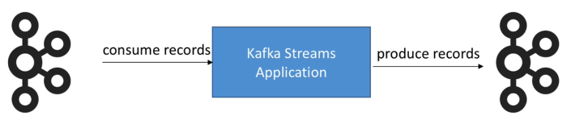

# Testing

- Test the topology object of your Kafka Streams application
- Does not require to run Kafka in your tests

When running a Kafka Streams application:

When testing a Kafka Streams application:

