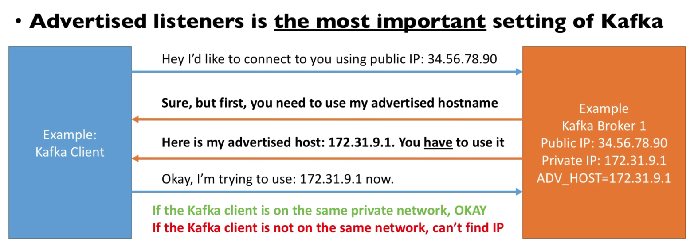
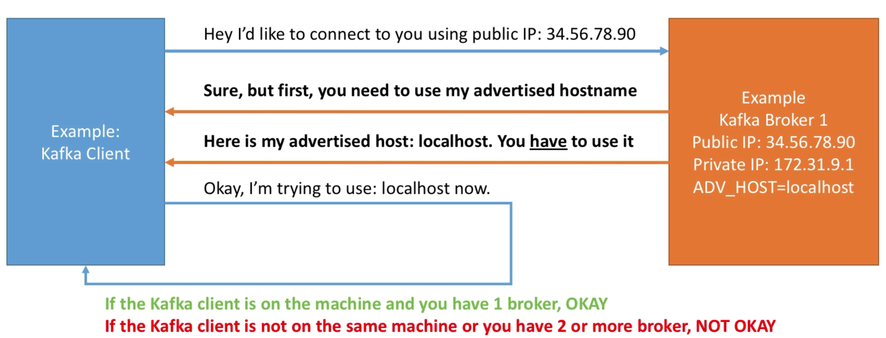
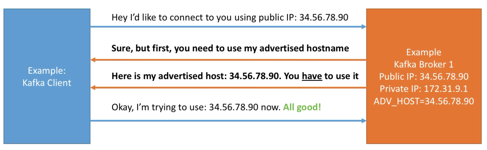
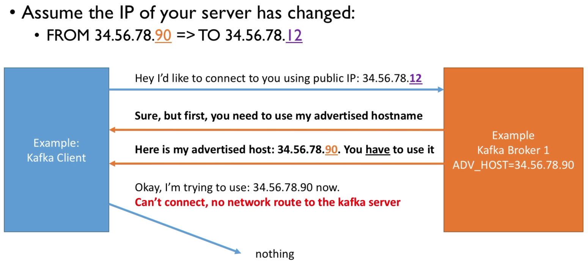

# Docker Booting Kafka

From [Setup](../../docs/setup.md) you should already have Docker "homebrewed".

---

What if I use the public IP?

But after a reboot (say on the cloud) Kafka and public IP changes?

