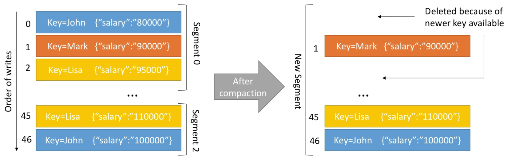

# Log Policies

- log.cleanup.policy = delete
  - Default for all user topics
  - Delete based on age of data (default is 1 week) - log.retention.hours = 168
  - Delete based on maximum size of log (default is -1 = infinite) - log.retention.bytes = -1
- log.cleanup.policy = compact
  - Default for topic **__consumer_offsets**
  - Delete based on keys of your messages
  - Delete old duplicate keys **after** the active segment is committed
  - Infinite time and space retention

## Log Compaction

Let's say we have the topic **employee-salary** and we want to keep them most recent salary for our employees:

> 