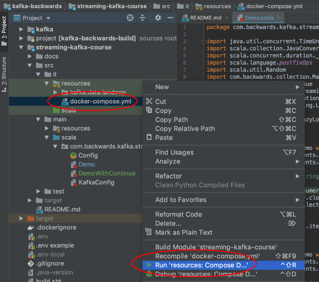
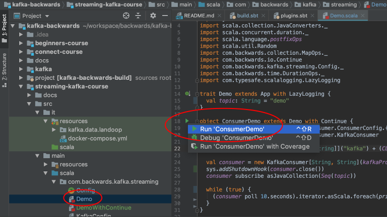
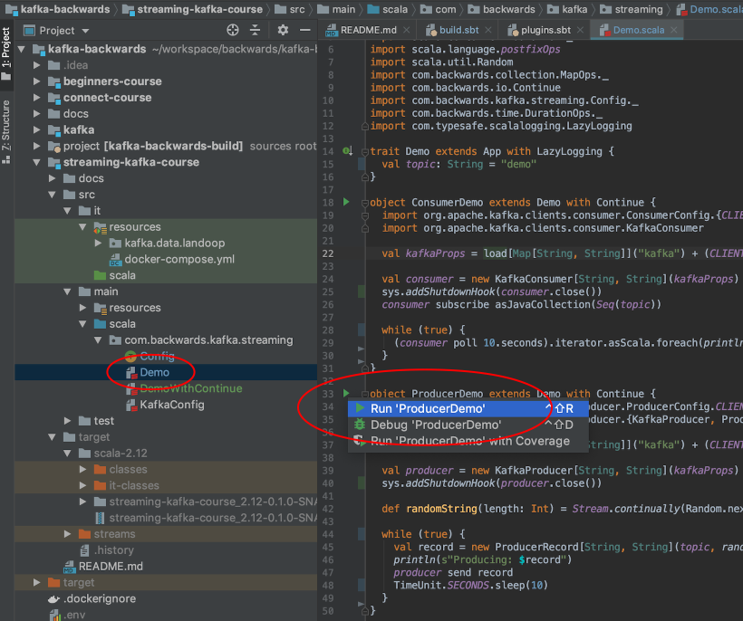
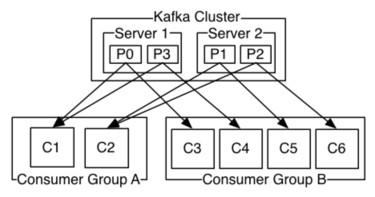

# Producer & Consumer APIs

Start up Kafka (and Zookeeper) either from command line or IntelliJ as shown below:

```bash
kafka-backwards/streaming-kafka-course/src/it/resources
$ docker-compose up
```



## Consumer

Either boot from command line or IntelliJ as shown below:

```bash
$ sbt "; project streaming-kafka-course; runMain com.backwards.kafka.streaming.demo.ConsumerDemo"
```

or

```bash
$ sbt "project streaming-kafka-course" "runMain com.backwards.kafka.streaming.demo.ConsumerDemo"
```



## Producer

Either boot from command line of IntelliJ as shown below:

```bash
$ sbt "; project streaming-kafka-course; runMain com.backwards.kafka.streaming.demo.ProducerDemo"
```

or

```bash
$ sbt "project streaming-kafka-course" "runMain com.backwards.kafka.streaming.demo.ProducerDemo"
```



## Topic

- Single partition:
  - No two consumers, within the same consumer group, can read from the same partition.
  - We can use multiple consumers belonging to different consumer groups to read the same copy of data from the *topic* or *topic partition* multiple times using multiple threads.
  - Options are limited to improve performance.
- Multi-Partition:
  - Provides different options to improve performance significantly.
  - We can produce messages into partitions in round robin fashion. With CLI we cannot write to a specific partition or use a custom algorithm. However, APIs provides a lot more flexibility.
  - We can consumer messages from all partitions in round robin, use group ID or specify a partition, via APIs.



```bash
$ kafka-topics --zookeeper localhost:2181 --list 
__consumer_offsets
...
demo
```

```bash
$ kafka-topics \
--zookeeper localhost:2181 \
--create \
--topic multi \
--partitions 4 \
--replication-factor 1
Created topic "multi".
```

And to delete a topic:

```bash
$ kafka-topics \
--zookeeper localhost:2181 \
--delete \
--topic multi
```

## ProducerRecord with Key

- When we pass the key to produce messages into the partitioned topic, by default it will compute the hash of the key and then apply **mod** using the number of partitions used when creating the topic.
- It will ensure all the messages using the same key will always go to the same partition.

```bash
kafka-backwards
$ sbt console
...
scala> :javap -p org.apache.kafka.clients.producer.ProducerRecord
...
Compiled from "ProducerRecord.java"
public class org.apache.kafka.clients.producer.ProducerRecord<K, V> {
  private final java.lang.String topic;
  private final java.lang.Integer partition;
  private final org.apache.kafka.common.header.Headers headers;
  private final K key;
  private final V value;
  private final java.lang.Long timestamp;
  public org.apache.kafka.clients.producer.ProducerRecord(java.lang.String, java.lang.Integer, java.lang.Long, K, V, java.lang.Iterable<org.apache.kafka.common.header.Header>);
  public org.apache.kafka.clients.producer.ProducerRecord(java.lang.String, java.lang.Integer, java.lang.Long, K, V);
  public org.apache.kafka.clients.producer.ProducerRecord(java.lang.String, java.lang.Integer, K, V, java.lang.Iterable<org.apache.kafka.common.header.Header>);
  public org.apache.kafka.clients.producer.ProducerRecord(java.lang.String, java.lang.Integer, K, V);
  public org.apache.kafka.clients.producer.ProducerRecord(java.lang.String, K, V);
  public org.apache.kafka.clients.producer.ProducerRecord(java.lang.String, V);
  public java.lang.String topic();
  public org.apache.kafka.common.header.Headers headers();
  public K key();
  public V value();
  public java.lang.Long timestamp();
  public java.lang.Integer partition();
  public java.lang.String toString();
  public boolean equals(java.lang.Object);
  public int hashCode();
}
```

Take a look at [Demo.scala](../src/main/scala/com/backwards/kafka/streaming/demo/Demo.scala).

## PartitionRecord without Key

Take a look at [DemoNoKeys.scala](../src/main/scala/com/backwards/kafka/streaming/demo/DemoNoKeys.scala)